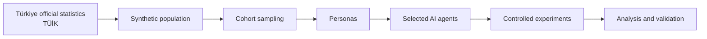

# SocietyTwin — AI-Powered Digital Society Twin for Türkiye

SocietyTwin is an Engineering Design II research project that aims to build a synthetic population of Türkiye from official statistics and use it for controlled, reproducible experiments with AI-powered personas. It is meant for population-level exploration and hypothesis generation, not for predicting individual behaviour.

## Project Status

- The Türkiye-only, large-scale direction comes from the latest instructor feedback.
- The v2 architecture was drafted in response to that feedback ([docs/](docs/)).
- Detailed architecture and implementation decisions still require instructor and team review.
- Implementation has not started; the repository contains documentation and placeholder folders.

## Why Türkiye

- The instructor asked for a project focused only on Türkiye.
- TÜİK (Turkish Statistical Institute) publishes official population statistics every year down to district level (2025: 86,092,168 residents), plus survey statistics on education, employment, households, and internet use.
- Every synthetic record belongs to one of Türkiye's 81 provinces and uses TÜİK's official categories, so results can be compared with Turkish statistics.

## Core Idea

Related attributes, such as age, education, and employment, are generated together so that they stay consistent with published TÜİK tables. The population is validated against official statistics before it is used.

SocietyTwin is inspired by architectural ideas from large-scale synthetic-persona systems such as MatrAIx, but it is a separate Türkiye-specific academic project.

## Population Records, Personas and AI Agents

| Level | What it is | Uses an LLM? |
|---|---|---|
| **Population record** | A lightweight synthetic record of a fictional resident of Türkiye (for example province, sex, age, education, employment status) | No |
| **Persona** | A richer description constructed from a sampled record | No |
| **Active AI agent** | A selected persona temporarily connected to an LLM for one experiment | Yes |

Population size is not the same as the number of LLM agents. A population can contain 100,000 or more records, but each experiment turns only a small, budget-limited sample into AI agents.

## Proposed MVP

The MVP aims to show one complete path from data to results:

- ingest selected official Türkiye data (TÜİK);
- generate a synthetic population with dependency-aware generation;
- build benchmark populations of 10K and 100K records;
- validate the population statistically against official tables;
- sample cohorts and construct personas;
- run a small, controlled AI experiment;
- analyse results by subgroup;
- provide a basic dashboard / playground;
- make every run reproducible (seeds, configurations, versions).

A 1M-record build is an optional scalability benchmark if time allows; the final required population scale is still an open decision. Stretch goals and the roadmap are in the [architecture report](docs/societytwin-v2-architecture.md#29-mvp).

## Technology

Proposed high-level stack:

- Python, FastAPI
- NumPy, pandas, PyArrow
- Parquet, DuckDB, PostgreSQL
- Next.js, TypeScript
- Provider-independent LLM adapter
- Docker, GitHub Actions

Details and justifications: [docs/architecture.md](docs/architecture.md).

## Documentation

| Document | What it covers |
|---|---|
| [v2 architecture report](docs/societytwin-v2-architecture.md) | Full design, decisions, MVP, roadmap, open questions |
| [Architecture reference](docs/architecture.md) | Modules, interfaces, technology |
| [Project overview](docs/project-overview.md) | Problem, research questions, scope |
| [Persona schema](docs/persona-schema.md) | Attributes, data sources, dependencies |
| [Data strategy](docs/data-strategy.md) | TÜİK and other sources, access, licences |
| [Validation strategy](docs/validation-strategy.md) | How the population and experiments are validated |
| [Experiment system](docs/experiment-system.md) | Playground workflow and experiment types |
| [Ethics and limitations](docs/ethics-and-limitations.md) | Privacy, bias, and limits |
| [Methodology](docs/methodology.md) | Research methodology |
| [Sources](docs/sources.md) | Literature, reference systems, and data sources |
| [Migration plan](docs/migration-plan.md) | Changes from the earlier v1 design ([archived](docs/archive/architecture-v1-demographic.md)) |
| [Team responsibilities](docs/team-responsibilities.md) and [research integration](docs/research-integration.md) | Research roles and how they fit together |
| [Data handling](data/README.md) | Rules for the data folder |

## Team

Current research-phase responsibilities:

| Team member | Responsibility |
|---|---|
| Bejan | Project Manager / System Architect |
| Sam | Literature Research |
| Pakhlavon | Technical Architecture / Technologies |
| Azra | Existing Systems / Similar Projects |
| Koray | Data + Population + Simulation Research |

Ownership of SocietyTwin v2 implementation modules has not yet been assigned.

## Data, Privacy and Limitations

- The MVP is designed to use official aggregate statistics, primarily from TÜİK, as its main data foundation. No real-person records or personally identifiable information are used.
- Synthetic personas are fictional and identified by codes, not names. SocietyTwin does not reconstruct or represent real Turkish citizens.
- SocietyTwin is for population-level research only; its results are not guaranteed predictions of real human behaviour.
- The sensitive categories defined in Türkiye's data protection law (KVKK Article 6), such as ethnic origin, religion, political opinion, and health, are excluded from the persona schema.
- No dataset, generated population, or experiment result is committed to this repository.

More detail: [ethics and limitations](docs/ethics-and-limitations.md) and [data/README.md](data/README.md).
