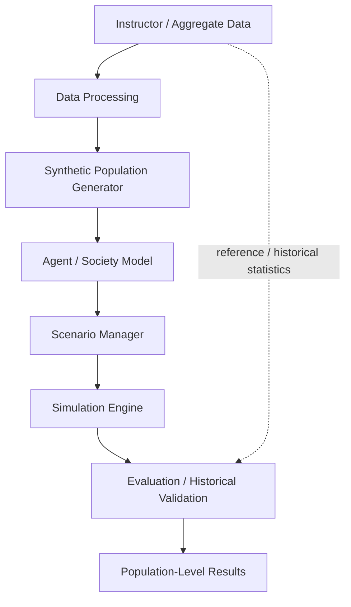

# SocietyTwin — AI-Powered Digital Society Twin

**Engineering Design II · University project**

> **Current status:** Research, requirements analysis, and initial repository setup.
> No simulation features have been implemented yet.

> **SocietyTwin is intended for population-level research and simulation, not individual-level prediction.**

## Contents

1. [Overview](#overview)
2. [Objective](#objective)
3. [Problem](#problem)
4. [Planned architecture](#planned-architecture)
5. [Current status](#current-status)
6. [Project scope](#project-scope)
7. [Repository structure](#repository-structure)
8. [Research areas](#research-areas)
9. [Team responsibilities](#team-responsibilities)
10. [Academic / ethical boundary](#academic--ethical-boundary)
11. [Documentation links](#documentation-links)

## Overview

SocietyTwin is a planned computational social simulation, or *digital society twin*. It will build a synthetic population from aggregate statistical data, represent people and households as computational agents, and use agent-based simulation to study how population-level patterns emerge under controlled scenarios.

The project aims to:

- construct synthetic populations from aggregate statistical data;
- represent people and households as computational agents;
- simulate controlled socioeconomic or demographic scenarios;
- analyze population-level emergent behavior;
- compare simulation results with known aggregate or historical data;
- evaluate and validate the model.

## Objective

SocietyTwin's objective is to build a reproducible, validated agent-based simulation of a synthetic population that can be used to study how controlled changes affect population-level outcomes.

The planned objectives are to:

1. **Understand the data.** Document the structure, variables, coverage, and limitations of the instructor-provided dataset.
2. **Generate a synthetic population.** Create synthetic agents and households whose aggregate distributions match the source statistics within documented tolerances.
3. **Model agent behavior.** Define transparent, documented behavioral rules for agents and households.
4. **Establish a baseline.** Build a baseline society that represents the population without any scenario intervention.
5. **Run controlled scenarios.** Change one or more conditions relative to the baseline and measure the aggregate effect.
6. **Ensure reproducibility.** Make every experiment repeatable from a recorded configuration and random seed.
7. **Validate the model.** Compare the synthetic population and simulation outputs with reference or historical aggregate data, and report limitations clearly.

The final system definition, including target users and system boundaries, is being prepared by the Project Manager / System Architect (see [team responsibilities](docs/team-responsibilities.md)).

## Problem

Real societies are complex systems: the choices and circumstances of individuals and households combine to produce patterns that can only be seen at the population level. These patterns are difficult to study directly. Real-world experiments on a population are usually impractical or unethical, and aggregate statistics alone do not show how individual-level mechanisms produce them. SocietyTwin aims to study such patterns in a controlled, reproducible computational environment.

The input data will be aggregate statistics provided by the course instructor at a later stage. **The actual population schema will depend on the variables available in that dataset.** Possible examples include age, gender, education, employment status, income, household structure, occupation, or geographic area, but none of these is assumed until the dataset has been received and reviewed.

## Planned architecture

> **Preliminary.** This architecture is not final and will change as research progresses.



Each stage and its planned module is described in [docs/architecture.md](docs/architecture.md).

### Technology (under research)

Technologies have not been selected. Pakhlavon (Technical Architecture / Technologies) is evaluating them, and every technology must answer the question *"Why does SocietyTwin actually need this technology?"* before it is adopted. The candidates below were noted during repository setup and are not decisions.

| Area | Candidate |
|---|---|
| Programming language | Python 3 |
| Data processing | NumPy, pandas |
| Agent-based simulation | A custom engine, or an existing framework such as Mesa |
| Testing | pytest |
| Documentation | Markdown, with Mermaid diagrams rendered by GitHub |
| Version control | Git and GitHub |

The core model is planned as a rule-based agent-based simulation. Research on LLM-driven agents is used as conceptual inspiration only (see [docs/sources.md](docs/sources.md)); it is not a requirement for SocietyTwin agents.

## Current status

**Phase:** Research, requirements analysis, and initial repository setup.

| Work item | Status |
|---|---|
| System definition and scope (Bejan) | Assigned; research phase |
| Literature research (Sam) | Assigned; 5 verified core sources recorded |
| Technical architecture research (Pakhlavon) | Assigned; research phase |
| Existing systems research (Azra) | Assigned; research phase |
| Data, population, and simulation research (Koray) | Assigned; research phase |
| Repository structure and documentation | Initial version complete |
| Architecture | Preliminary; not final |
| Instructor dataset | Awaiting delivery |
| Implementation (all modules) | Not started |

No code, datasets, or simulation results exist in this repository yet.

## Project scope

The scope is deliberately limited, because a "digital society twin" can easily grow unrealistically large. The full lists are in [docs/project-overview.md](docs/project-overview.md#in-scope).

**In scope (planned capabilities):** processing instructor-provided aggregate data, synthetic population generation, population-level agent representation, agent-based social/economic simulation, controlled scenario definition and execution, aggregate result analysis, statistical similarity analysis, historical/empirical validation where suitable data exists, model comparison, reproducible experiments, and population-level visualization of results.

**Out of scope:** predicting the behavior of specific real individuals, individual surveillance, identifying real people, reconstructing identifiable individuals, real-time surveillance systems, claiming perfect prediction of society, automatically making government or political decisions, treating simulation results as guaranteed real-world outcomes, building an unlimited or full digital replica of society, and using private or personally identifiable data without authorization.

## Repository structure

```text
AI-powered-digital-society-twin/
├── README.md                    Project overview (this file)
├── .gitignore                   Keeps datasets, secrets and generated files out of Git
├── requirements.txt             Python dependencies (none required yet)
├── data/                        Data folders; no datasets are committed
│   ├── README.md                Data handling rules
│   ├── raw/                     Original instructor-provided data (git-ignored)
│   └── processed/               Cleaned and transformed data (git-ignored)
├── src/                         Source code (planned modules; none implemented)
│   ├── data_processing/         Data Processing
│   ├── population/              Synthetic Population Generator
│   ├── agents/                  Agent / Society Model
│   ├── scenarios/               Scenario Manager
│   ├── simulation/              Simulation Engine
│   ├── validation/              Evaluation / Historical Validation
│   └── analysis/                Population-Level Results
├── docs/                        Project documentation
│   ├── project-overview.md      Problem, approach, scope
│   ├── architecture.md          Preliminary architecture
│   ├── methodology.md           Planned methodology
│   ├── sources.md               Literature research
│   ├── team-responsibilities.md Team roles and deliverables
│   └── research-integration.md  How the research streams combine
├── experiments/                 Reproducible scenario configurations and outputs
└── tests/                       Automated tests (added with the implementation)
```

## Research areas

The project is in its research phase. Each research stream has a named owner and an expected deliverable:

| Research stream | Owner | Focus | Expected deliverable |
|---|---|---|---|
| System definition and integration | Bejan | Objective, users, problem, boundaries, capabilities, architecture, scope | Integrated SocietyTwin design |
| Academic foundations | Sam | Digital twins, social simulation, agent-based modeling, synthetic populations, generative and LLM-based agents | 8–10 reviewed sources ([sources.md](docs/sources.md)) |
| Technical architecture | Pakhlavon | Languages, frameworks, data, backend, frontend, testing, GitHub workflow | Justified technology assessment |
| Existing systems | Azra | Social and socio-technical digital twins, synthetic population systems, agent-based society simulations | Existing work → gap → contribution |
| Population, agents, and simulation | Koray | Population representation, agent design, simulation concept, evaluation | Population Schema + Agent Schema + Simulation Concept |

How these streams come together is described in [docs/research-integration.md](docs/research-integration.md). The planned research methodology is in [docs/methodology.md](docs/methodology.md).

## Team responsibilities

| Team member | Role |
|---|---|
| Bejan | Project Manager / System Architect |
| Sam | Literature Research |
| Pakhlavon | Technical Architecture / Technologies |
| Azra | Existing Systems / Similar Projects |
| Koray | Data + Population + Simulation Research |

Full responsibilities and deliverables: [docs/team-responsibilities.md](docs/team-responsibilities.md)

- **Course:** Engineering Design II
- **Instructor:** *To be added*
- **Institution:** *To be added*

## Academic / ethical boundary

SocietyTwin is a university engineering project developed for educational and research purposes.

- **SocietyTwin is intended for population-level research and simulation, not individual-level prediction.**
- Synthetic agents are statistical constructs. They do not represent, identify, or reconstruct real people.
- Any results the model produces will be simulated outputs based on stated assumptions. They are not forecasts, are not guaranteed real-world outcomes, and must not be used to make decisions about specific individuals or to make government or political decisions automatically.
- This repository does not contain any dataset. Instructor-provided data will be used only under the terms on which it is supplied, and sensitive, private, or restricted data will not be committed to GitHub (see [data/README.md](data/README.md)).
- Published research that informs the project is credited in [docs/sources.md](docs/sources.md).

## Documentation links

**Project documents**

- [Project overview](docs/project-overview.md): problem, approach, in scope and out of scope
- [Architecture](docs/architecture.md): preliminary conceptual pipeline
- [Methodology](docs/methodology.md): planned research methodology
- [Research sources](docs/sources.md): literature research
- [Team responsibilities](docs/team-responsibilities.md): roles and deliverables
- [Research integration](docs/research-integration.md): how the research streams combine
- [Data handling](data/README.md): data folders and privacy rules

**Planned modules**

[data_processing](src/data_processing/README.md) · [population](src/population/README.md) · [agents](src/agents/README.md) · [scenarios](src/scenarios/README.md) · [simulation](src/simulation/README.md) · [validation](src/validation/README.md) · [analysis](src/analysis/README.md) · [experiments](experiments/README.md) · [tests](tests/README.md)
