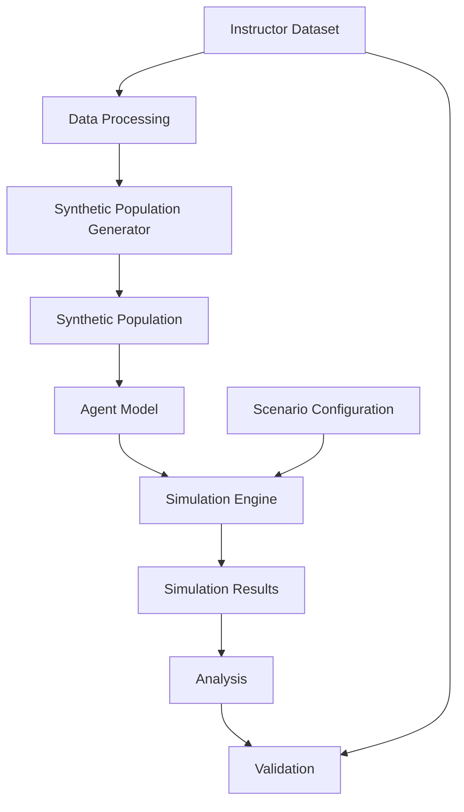

# SocietyTwin — AI-Powered Digital Society Twin

**Engineering Design II · University project**

> **Current status:** Research, requirements analysis, and initial repository setup.
> No simulation features have been implemented yet.

SocietyTwin is a planned computational social simulation, or *digital society twin*. It will build a synthetic population from aggregate statistical data, represent people and households as computational agents, and use agent-based simulation to study how population-level patterns emerge under controlled scenarios.

> **Scope:** This system is intended for population-level research and simulation. It is not intended to predict the behavior of specific individuals.

## Contents

1. [Project description](#project-description)
2. [Objectives](#objectives)
3. [High-level architecture](#high-level-architecture)
4. [Planned workflow](#planned-workflow)
5. [Repository structure](#repository-structure)
6. [Current project status](#current-project-status)
7. [Research methodology](#research-methodology)
8. [Technology](#technology)
9. [Team](#team)
10. [Academic disclaimer](#academic-disclaimer)

## Project description

Real societies are complex systems: the choices and circumstances of individuals and households combine to produce patterns that can only be seen at the population level. SocietyTwin aims to study such patterns in a controlled, reproducible computational environment.

The project aims to:

- construct synthetic populations from aggregate statistical data;
- represent people and households as computational agents;
- simulate controlled socioeconomic or demographic scenarios;
- analyze population-level emergent behavior;
- compare simulation results with known aggregate or historical data;
- evaluate and validate the model.

The input data will be aggregate statistics provided by the course instructor at a later stage. The variables the model uses will depend on that dataset. Possible examples include age, gender, education, employment status, income, household size and structure, occupation, or geographic area, but none of these is assumed until the dataset has been received and reviewed.

## Objectives

1. **Understand the data.** Document the structure, variables, coverage, and limitations of the instructor-provided dataset.
2. **Generate a synthetic population.** Create synthetic agents and households whose aggregate distributions match the source statistics within documented tolerances.
3. **Model agent behavior.** Define transparent, documented behavioral rules for agents and households.
4. **Establish a baseline.** Build a baseline society that represents the population without any scenario intervention.
5. **Run controlled scenarios.** Change one or more conditions relative to the baseline and measure the aggregate effect.
6. **Ensure reproducibility.** Make every experiment repeatable from a recorded configuration and random seed.
7. **Validate the model.** Compare the synthetic population and simulation outputs with reference or historical aggregate data, and report limitations clearly.

## High-level architecture



Each component is described in [docs/architecture.md](docs/architecture.md).

## Planned workflow

```text
Instructor Dataset
        ↓
Data Processing
        ↓
Synthetic Population Generation
        ↓
Synthetic Agents / Households
        ↓
Baseline Society
        ↓
Scenario Simulation
        ↓
Aggregate Results
        ↓
Validation / Comparison with Real or Historical Data
```

## Repository structure

```text
AI-powered-digital-society-twin/
├── README.md               Project overview (this file)
├── .gitignore              Keeps datasets, secrets and generated files out of Git
├── requirements.txt        Python dependencies (none required yet)
├── data/                   Data folders; no datasets are committed
│   ├── README.md           Data handling rules
│   ├── raw/                Original instructor-provided data (git-ignored)
│   └── processed/          Cleaned and transformed data (git-ignored)
├── src/                    Source code (planned modules)
│   ├── data_processing/    Loading and cleaning the dataset
│   ├── population/         Synthetic population generation
│   ├── agents/             Agent and household definitions and rules
│   ├── simulation/         Simulation engine and scenario execution
│   ├── analysis/           Aggregate statistics and result analysis
│   └── validation/         Comparison with reference and historical data
├── docs/                   Project documentation
│   ├── project-overview.md
│   ├── methodology.md
│   ├── architecture.md
│   └── sources.md
├── experiments/            Reproducible scenario configurations and outputs
└── tests/                  Automated tests (added with the implementation)
```

Each module folder contains a README describing its planned purpose: [data_processing](src/data_processing/README.md), [population](src/population/README.md), [agents](src/agents/README.md), [simulation](src/simulation/README.md), [analysis](src/analysis/README.md), [validation](src/validation/README.md), [experiments](experiments/README.md), [tests](tests/README.md) and [data](data/README.md).

## Current project status

**Phase:** Research, requirements analysis, and initial repository setup.

| Work item | Status |
|---|---|
| Literature review | In progress |
| Requirements analysis | In progress |
| Repository structure and documentation | Initial version complete |
| Instructor dataset | Awaiting delivery |
| Data processing | Not started |
| Synthetic population generation | Not started |
| Agent model and simulation engine | Not started |
| Analysis and validation | Not started |

No code, datasets, or simulation results exist in this repository yet.

## Research methodology

The project will follow a staged methodology, from data understanding through synthetic population generation, agent modeling, baseline and scenario simulation, aggregate analysis, and empirical validation. Validation is planned at two levels: checking that the synthetic population reproduces the source statistics, and checking that simulation outputs are consistent with known aggregate or historical data.

- Full methodology: [docs/methodology.md](docs/methodology.md)
- Problem statement and stages: [docs/project-overview.md](docs/project-overview.md)
- Research sources: [docs/sources.md](docs/sources.md)

## Technology

The technology stack has not been finalized. The table below lists the current plan; final choices will be recorded in [requirements.txt](requirements.txt) when implementation begins.

| Area | Plan |
|---|---|
| Programming language | Python 3 (planned) |
| Data processing | NumPy and pandas (under consideration) |
| Agent-based simulation | A custom engine or an existing framework such as Mesa (to be decided) |
| Testing | pytest (planned) |
| Documentation | Markdown, with Mermaid diagrams rendered by GitHub |
| Version control | Git and GitHub |

The core model is planned as a rule-based agent-based simulation. Research on LLM-driven agents is used as conceptual inspiration only (see [docs/sources.md](docs/sources.md)); it is not a requirement for SocietyTwin agents.

## Team

| Name | Role |
|---|---|
| Sam Karimpour | *Role to be added* |
| *Team member* | *Role to be added* |
| *Team member* | *Role to be added* |

- **Course:** Engineering Design II
- **Instructor:** *To be added*
- **Institution:** *To be added*

## Academic disclaimer

SocietyTwin is a university engineering project developed for educational and research purposes.

- Any results the model produces will be simulated outputs based on stated assumptions. They are not forecasts and must not be used to make decisions about specific individuals.
- This system is intended for population-level research and simulation. It is not intended to predict the behavior of specific individuals.
- This repository does not contain any dataset. Instructor-provided data will be used only under the terms on which it is supplied, and sensitive or restricted data will not be committed to GitHub (see [data/README.md](data/README.md)).
- Published research that informs the project is credited in [docs/sources.md](docs/sources.md).
