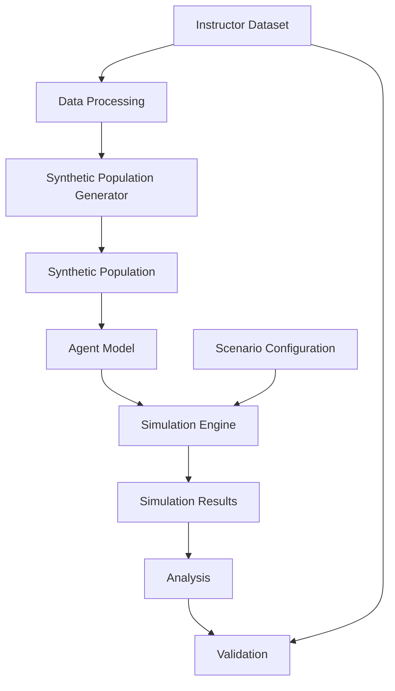

# Architecture

**Status:** Planned. This is the intended high-level design; no components have been implemented yet.

## Overview

Data flows from the instructor dataset, through population generation and simulation, to analysis and validation. The direct link from the dataset to validation shows that reference statistics are also used to check the model's outputs.

## Components

| Component | Planned role | Planned location |
|---|---|---|
| Instructor Dataset | Aggregate statistical data provided by the instructor. It is the source for population generation and the reference for validation. It is never committed to Git. | `data/raw/` |
| Data Processing | Cleans and harmonizes the raw data into consistent aggregate tables. | `src/data_processing/` → `data/processed/` |
| Synthetic Population Generator | Creates artificial individuals and households whose aggregate characteristics match the processed statistics, using a recorded random seed. | `src/population/` |
| Synthetic Population | The generated set of individuals and households. It is regenerated from the configuration and seed rather than stored. | produced by `src/population/` |
| Agent Model | Defines agent and household attributes and the behavioral rules that change their state over time. | `src/agents/` |
| Scenario Configuration | Describes a controlled scenario: which conditions differ from the baseline, the simulation length, and the random seed. | `experiments/configs/` |
| Simulation Engine | Advances the agents through time for the baseline society and each scenario, keeping random draws aligned between them. | `src/simulation/` |
| Simulation Results | Aggregate indicators recorded at each timestep for the baseline and each scenario. | `experiments/outputs/` (git-ignored) |
| Analysis | Computes population-level statistics and compares scenarios with the baseline. | `src/analysis/` |
| Validation | Compares the synthetic population and simulation outputs with reference or historical aggregate data. | `src/validation/` |

## Design principles

- **Population-level focus.** Components produce and report aggregate results. The system is not designed to predict the behavior of specific individuals.
- **Reproducibility.** The same dataset version, configuration, random seed, and code version should always produce the same results.
- **Separation of data and code.** Datasets stay outside Git. The processed data and synthetic population can be regenerated by code.
- **Modularity.** Each stage has its own module with clear inputs and outputs, so that it can be developed, tested, and validated independently.
- **Transparency.** Assumptions, parameters, and behavioral rules are documented alongside the code.

The detailed design, including data formats and interfaces between components, will be defined once the instructor's dataset has been reviewed.
