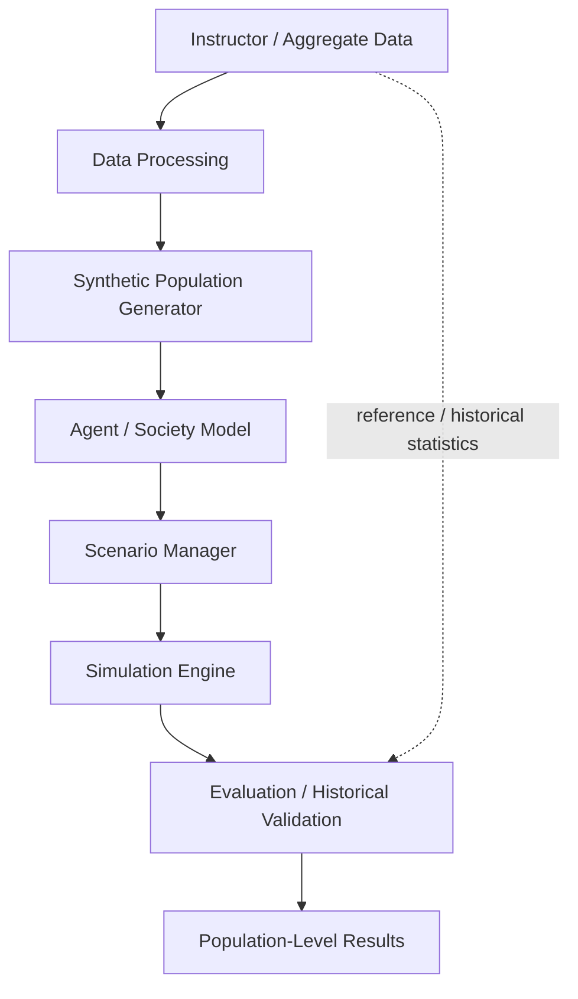

# Architecture

> **Preliminary architecture.** This is the current conceptual design, based on the team's Project Management document. It is not final and will change as the research streams report back and once the instructor's dataset has been reviewed. No components have been implemented yet.

## Conceptual pipeline

Solid arrows show the main flow of data through the pipeline. The dashed arrow shows that Evaluation / Historical Validation also uses reference statistics directly: the aggregate data the population was built from, and historical data where suitable, permitted data exists.

## Stages

| Stage | Planned role | Planned location |
|---|---|---|
| Instructor / Aggregate Data | Aggregate statistical data provided by the instructor. It is the source for population generation and a reference for evaluation. It is never committed to Git. | `data/raw/` |
| Data Processing | Cleans and harmonizes the raw data into consistent aggregate tables. | `src/data_processing/` → `data/processed/` |
| Synthetic Population Generator | Creates artificial individuals and households whose aggregate characteristics match the processed statistics, using a recorded random seed. The population is regenerated from its configuration and seed rather than stored. | `src/population/` |
| Agent / Society Model | Turns the synthetic population into agents and households with attributes, states, and documented behavioral rules. Interactions, social networks, and the environment will be included only where the research and data support them. | `src/agents/` |
| Scenario Manager | Defines the baseline and the controlled scenarios, checks scenario configurations, and makes sure each scenario shares its baseline's population and random seed. It does not run simulations. | `src/scenarios/`, `experiments/configs/` |
| Simulation Engine | Advances the society model through time for the baseline and each scenario, keeping random draws aligned between them, and records aggregate outputs at each timestep. | `src/simulation/` |
| Evaluation / Historical Validation | Checks the statistical similarity of the synthetic population to the source data, compares simulated aggregates with reference or historical data, checks scenario consistency, and compares the model with simpler alternatives. | `src/validation/` (using statistics from `src/analysis/`) |
| Population-Level Results | Aggregate indicators and scenario-versus-baseline comparisons, reported together with their evaluation status and known limitations. | `src/analysis/`, `experiments/outputs/` (git-ignored) |

### Why evaluation comes before results

In this pipeline, results are reported only after they have been evaluated. Every population-level result should come with a statement of how well the model agrees with the reference data, so that simulated outputs are not mistaken for real-world facts.

## Design principles

- **Population-level focus.** Components produce and report aggregate results. SocietyTwin is intended for population-level research and simulation, not individual-level prediction.
- **Data-driven schema.** The population and agent attributes will depend on the variables actually available in the instructor-provided dataset. None are assumed in advance.
- **Reproducibility.** The same dataset version, configuration, random seed, and code version should always produce the same results.
- **Separation of data and code.** Datasets stay outside Git. The processed data and synthetic population can be regenerated by code.
- **Modularity.** Each stage has its own module with clear inputs and outputs, so that it can be developed, tested, and validated independently.
- **Transparency.** Assumptions, parameters, and behavioral rules are documented alongside the code.
- **Justified technology.** Every technology must answer the question "Why does SocietyTwin actually need this technology?" before it is adopted.

## Changes from the initial repository architecture

The first version of this document (initial repository setup) used a ten-component diagram. This version aligns it with the Project Management document:

- **Scenario Manager** is now a separate stage with its own planned module, `src/scenarios/`, instead of a configuration input to the Simulation Engine.
- **Synthetic Population** and **Agent Model** are combined into one **Agent / Society Model** stage. The generated population is treated as the generator's output.
- **Analysis** and **Validation** are combined into **Evaluation / Historical Validation**, followed by **Population-Level Results** as the final stage.

## Open architecture questions

These questions are assigned to the research streams described in [team-responsibilities.md](team-responsibilities.md) and will be resolved before the architecture is finalized.

| Question | Research stream |
|---|---|
| Which variables can the population and agent schemas include? | Koray (Data + Population + Simulation Research), after the dataset arrives |
| Do agents interact directly, for example through social networks, or only through shared conditions? | Koray |
| Which programming language, frameworks, and tools does SocietyTwin actually need, and why? | Pakhlavon (Technical Architecture / Technologies) |
| Does any part of the system need LLM-based agents, or is a rule-based model sufficient? | Pakhlavon and Sam (Literature Research) |
| What do existing systems do, and what gap will SocietyTwin address? | Azra (Existing Systems / Similar Projects) |
| What are the final system boundaries and capabilities? | Bejan (Project Manager / System Architect) |

The detailed design, including data formats and the interfaces between stages, will be defined after these questions have been answered.
