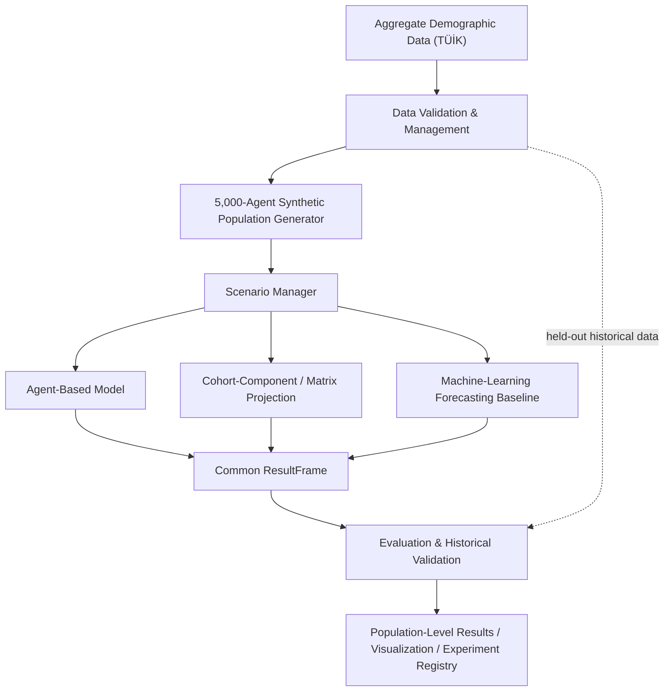
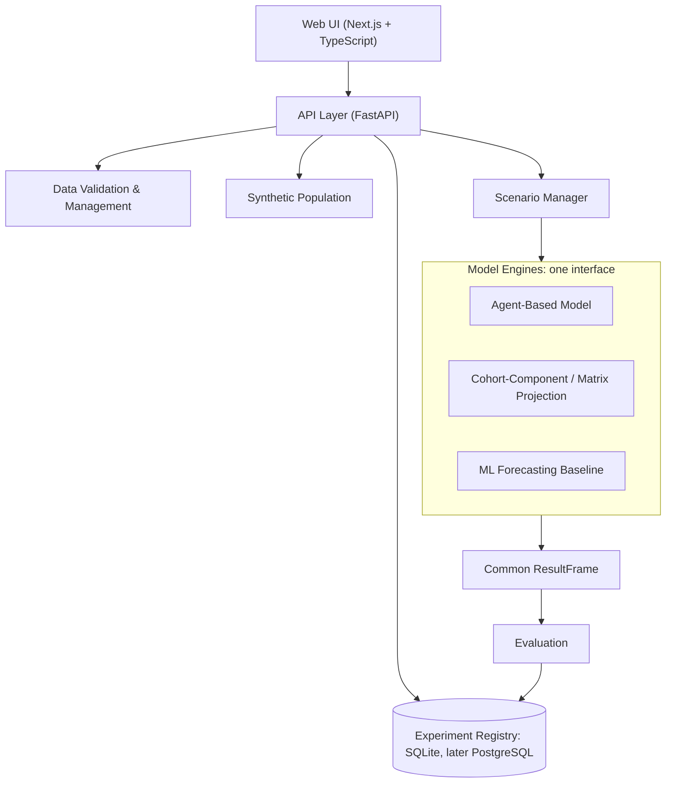

> **SUPERSEDED — historical record only.**
> This is the Final Technical Architecture v1.0 (5,000-agent demographic prototype comparing an Agent-Based Model, a Cohort-Component / Matrix Projection model, and an ML forecasting baseline). It was superseded by new instructor feedback (Türkiye-only, substantially larger scalable population, MatrAIx-inspired persona capabilities).
> The current design is the [SocietyTwin v2 Architecture Report](../societytwin-v2-architecture.md). Which v1 elements were kept, changed, or dropped is explained in [report §2 and §17](../societytwin-v2-architecture.md#17-abm--cohort--ml-integration-decision) and in the [migration plan](../migration-plan.md).
> Copied unchanged from branch `docs/align-latest-architecture` (commit `fc8b034`), except that relative links have been adjusted for the `archive/` folder. Links inside this document may point to documents that have since changed. The "MatrixAI reference" mentioned below is MatrAIx (Li et al., 2026), now listed in [sources.md](../sources.md#reference-systems).

# Final Technical Architecture

| Field | Detail |
|---|---|
| Project | Engineering Design II, Project 09: SocietyTwin — AI-Powered Digital Society Twin |
| Document | `docs/architecture.md`, Version 1.0 |
| Aligned with | TÜBİTAK 2209-B research proposal (latest version; highest authority) and SRS v1.0 (25.09.2026) |
| MVP scope | Türkiye · 5,000 initial synthetic agents · aging, births, deaths, migration |
| Implementation status | Architecture defined; no code has been written yet |

> **Terminology note.** Architecture v1.0 called the second model the "Differential-Equation / Cohort Model". This document uses the TÜBİTAK proposal's term, **Cohort-Component / Matrix Projection**. NumPy and SciPy remain the implementation tools.
>
> The SRS v1.0 is not stored in this repository. Requirement IDs (FR-, NFR-, TC-) refer to that document.

## 1. Purpose and design principles

This document answers the question "Technically, how do we build this?" It defines the architecture for a web-based research platform that:

- builds a synthetic population of 5,000 agents from official aggregate demographic data for Türkiye;
- runs demographic scenarios in yearly steps;
- compares three modelling paradigms on the same indicators;
- validates results against held-out historical data.

| Principle | What it means in practice |
|---|---|
| Population-level only | Agents are statistical samples. No real individual is represented or predicted (NFR-08). |
| Justify every technology | No tool is included because it sounds impressive. Each has a stated purpose and a fallback. |
| One shared data contract | All three models return the same Common ResultFrame, so the comparison is fair (FR-06). |
| Reproducibility first | Same data + model version + parameters + seed = same result (NFR-09). |
| Small first, extend later | The pipeline must work end to end with 5,000 agents before anything grows. |

**Scope note.** The course slide and an earlier team to-do used a policy example (a minimum-wage change). The SRS and the TÜBİTAK proposal narrow the first prototype to demographic change in Türkiye. This architecture follows them. The scenario layer includes an extension hook so that economic or policy scenarios can be added later without a redesign.

## 2. System architecture

### Core pipeline



The three model engines run the same scenario and return results in the same Common ResultFrame. Evaluation compares them with held-out historical data that the models were not calibrated on.

### System layers

The system is layered. The web UI talks only to the API. The API orchestrates the data, population, scenario, model, and evaluation services. All model engines share one interface and one output schema, and every run is stored in the experiment registry.



## 3. Component responsibilities

| Component | Responsibility | SRS |
|---|---|---|
| Data Validation & Management | Import CSV; check schema and values; store source, year, geography, variable definitions, and license; report bad rows. | FR-01, NFR-07, NFR-11 |
| Synthetic Population Generator | Generate 5,000 agents matching age × sex × region distributions; save and regenerate them from a seed. | FR-02 |
| Scenario Manager | Hold scenario parameters (birth, death, migration), start year, and duration; record indicators before and after. | FR-03 |
| Model Engines | Agent-Based Model, Cohort-Component / Matrix Projection, and ML forecasting baseline behind one interface. | FR-04, FR-06 |
| Evaluation | Compare simulated and historical age distributions; MAE, RMSE; held-out evaluation; runtime. | FR-05, FR-06.3 |
| API Layer | Expose functions to the UI; run experiments as background jobs; enforce roles. | NFR-03, NFR-06 |
| Web UI | Forms, charts, filters, history, CSV export. | FR-07, FR-08 |
| Storage / Experiment Registry | Persist experiments with ID, data source, model version, parameters, and seed. | FR-08, NFR-09, NFR-10 |

## 4. Technology choices and justification

| Layer | Choice | Why we need it | Fallback |
|---|---|---|---|
| Backend and simulation | Python 3.11+ | One language for data, simulation, ML, and API. | – |
| Agent framework | Mesa | Ready structure for agents, scheduling, and data collection. | Vectorized NumPy agent table if the 60 s target is missed |
| Cohort-Component / Matrix Projection | NumPy, SciPy | Age-structured projection with matrix operations; SciPy's solvers are available for a continuous-time formulation. | – |
| Machine learning | scikit-learn | Simple, explainable regressors: Ridge regression baseline, Gradient Boosting candidate. | statsmodels |
| Data processing | pandas, Pydantic / Pandera | Import, clean, and validate tabular demographic data. | Polars |
| API | FastAPI | Typed validation, automatic documentation, background tasks. | Flask |
| Database | SQLite, upgradeable to PostgreSQL | Experiment records and metadata; SQLite needs no setup. | JSON records |
| Bulk data | CSV in, Parquet out | CSV per FR-01; Parquet for compact, fast result tables. | CSV only |
| Frontend | Next.js + TypeScript | Component-based UI with a typed API client. | React (Vite) |
| Charts | Recharts / Plotly | Age distributions, time series, model comparison. | – |
| Testing | pytest, Vitest | Automate SRS test cases TC-01 to TC-10. | – |
| CI and workflow | GitHub Actions, GitHub Projects | Tests on every pull request; project boards. | – |

### Is an LLM used?

**Not in the core simulation.** Demographic events are driven by age-specific rates, not language reasoning. Calling an LLM for 5,000 agents over 10 years would be slow, costly, and non-deterministic, which would break NFR-02 (60 s) and NFR-09 (reproducibility).

| Possible LLM use | Needed? | Decision |
|---|---|---|
| Agent decisions at each step | No: probability rules are enough | Excluded |
| Generating agent attributes | No: sampling real distributions is more accurate | Excluded |
| Plain-language summary of results | Nice to have | Optional, post-MVP. Read-only; never changes numbers. |
| Natural-language scenario input | Nice to have | Optional, post-MVP. Must resolve to the normal parameter form. |

LLM-persona agents (as in the MatrixAI reference) are recorded as future work. The MatrixAI reference has not been added to [sources.md](../sources.md) yet; generative-agent research (Park et al., 2023) is listed there as future-work literature.

## 5. Data architecture

**Sources.** TÜİK (Turkish Statistical Institute) is the primary source for population by age, sex, and province, births, deaths, life tables, and migration. UN World Population Prospects and the World Bank are candidate fallback or cross-check sources. Access and licenses will be confirmed during the feasibility phase.

**Manifest.** Every dataset gets an entry in [`data/manifest.yaml`](../../data/manifest.yaml) recording its source, URL, reference year, scope, variables, license, download date, and checksum.

### Synthetic agent schema

| Field | Type | Note |
|---|---|---|
| `agent_id` | int / UUID | Unique (FR-02.2) |
| `age` | int | From the age × sex × region distribution |
| `sex` | category | Only if the source provides it |
| `region` | category | Classification fixed in the feasibility phase |
| `alive` | bool | Simulation state |
| `birth_year` | int | Derived |
| `origin` | category | `initial`, `born`, or `immigrant` (for accounting) |

Attributes missing from the source data are not invented, and assumptions are logged (SRS 2.2).

### Population generation method

1. Load the reference-year joint distribution (age group × sex × region).
2. Allocate exactly 5,000 agents to cells using largest-remainder rounding.
3. Sample a single-year age within each age group.
4. Assign unique IDs, and save the population with its seed and data version.
5. Compare it against the reference distribution and report the deviation (TC-02).

**Upgrade path:** Iterative Proportional Fitting, once more marginals (for example household or education) are available.

## 6. Scenario model

A scenario is a small, versioned configuration object. Planned presets: **baseline, low fertility, high fertility, higher net migration, faster aging**.

Illustrative example (the reference year and identifiers are not fixed yet):

```json
{
  "scenario_id": "baseline_10y",
  "population_id": "pop_2020_seed42",
  "start_year": 2020,
  "years": 10,
  "seed": 42,
  "parameters": {
    "birth_rate_multiplier": 1.0,
    "death_rate_multiplier": 1.0,
    "net_migration_per_year": 0,
    "migration_age_profile": "documented_assumption_v1"
  }
}
```

**Extension hook.** New parameter groups, for example `economy: {min_wage_change}`, can be added later. Engines ignore unsupported parameters and log the fact.

## 7. Model engines

All engines implement one interface, which makes the three-way comparison fair.

```python
class DemographicModel(Protocol):
    name: str
    version: str
    def fit(self, train: DataFrame) -> None: ...           # calibrate on the training period
    def run(self, scenario: Scenario) -> ResultFrame: ...  # simulate or project
```

**Common ResultFrame columns:** `year`, `age_group`, `sex`, `region`, `population`, `births`, `deaths`, `net_migration`

### 7.1 Agent-Based Model (Mesa)

- **Yearly step:** everyone ages by one year, then deaths, births, and migration are applied, and indicators are recorded.
- **Deaths:** each living agent dies with probability q(age, sex) from life tables, multiplied by the scenario multiplier.
- **Births:** eligible agents give birth with an age-specific fertility probability. New agents get unique IDs (`origin = born`).
- **Randomness:** one NumPy `Generator(seed)` is passed to everything.
- **Accounting invariant (TC-04):** final = initial + births − deaths + net migration, asserted at each step.
- **Scaling:** outputs are scaled to real totals only for historical comparison, and are labelled as such.

### 7.2 Cohort-Component / Matrix Projection (NumPy / SciPy)

- An age-structured population projected year by year, with aging transitions between age classes, age-specific mortality, fertility feeding the youngest age class, and a migration term.
- Deterministic, so it serves as an expected-value benchmark for the Agent-Based Model.

### 7.3 Machine-Learning Forecasting Baseline (scikit-learn)

- **Target:** age-group population (or share) for the next year. **Features:** lagged age-group counts, year, and lagged births, deaths, and migration.
- **Models:** Ridge regression as the baseline; Gradient Boosting as a stronger candidate.
- **Split:** strictly time-based (train on earlier years, test on later years), with no shuffling.
- **Limitation:** it learns from history and cannot respond causally to a new scenario. This is stated alongside its results.

### Model roles

| | Agent-Based Model | Cohort-Component / Matrix Projection | ML Forecasting Baseline |
|---|---|---|---|
| Strength | Individual events, heterogeneity, easy to extend with attributes | Fast, deterministic, interpretable | Flexible fit to historical data |
| Weakness | Stochastic noise at n = 5,000; slower | Ignores individual variation | Weak at what-if questions beyond history; needs enough data |
| Role | Main scenario engine | Benchmark and sanity check | Statistical baseline |

## 8. Evaluation and historical validation

- **Comparison target:** age-group distribution, using the same population base, period, and unit for real and simulated data (FR-05.2).
- **Metrics:** MAE, RMSE, per-age-group error, and runtime per model (FR-06.3).
- **Splits:** a calibration period versus an unseen validation period (FR-05.4), with identical splits for all three models (FR-06.2).
- **ABM noise:** run 10–30 seeds and report the mean and spread, never a single run.
- **Thresholds:** acceptable errors will be set after the data and generator are chosen (SRS section 9).
- **Failed runs** are stored as failed and excluded from comparisons (NFR-10).
- **Honest limit:** only baseline runs can be validated against history. Counterfactual scenarios cannot.

## 9. API design (FastAPI)

| Method | Endpoint | Purpose |
|---|---|---|
| POST | `/datasets` | Upload a CSV, validate it, register its metadata |
| GET | `/datasets` | List datasets and metadata |
| POST | `/populations` | Generate 5,000 agents `{dataset_id, seed}` |
| GET | `/populations/{id}/summary` | Distributions versus the reference |
| POST | `/experiments` | Start a run `{population_id, model, scenario}`; returns `experiment_id` |
| GET | `/experiments/{id}` | Status (queued / running / done / failed) and progress |
| GET | `/experiments/{id}/results` | Common ResultFrame as JSON |
| GET | `/experiments/{id}/export.csv` | CSV download |
| POST | `/validation` | Historical comparison `{experiment_id, reference_dataset, period}` |
| GET | `/comparison?experiments=a,b,c` | Three-model metrics and runtimes |

Long jobs run as background tasks (FastAPI `BackgroundTasks`, upgradeable to Celery or RQ), and the UI polls their status (NFR-03). Admin endpoints are role-protected (NFR-06).

## 10. Experiment registry

Every experiment stores the fields below, which supports FR-08 and NFR-09/10. TC-08 then becomes a simple test: rerun the same record and compare the outputs.

| Group | Fields |
|---|---|
| Identity | `experiment_id`, `created_at`, `status` |
| Inputs | `dataset_id` + checksum, `population_id`, scenario parameters (JSON), `seed` |
| Code | `model_name`, `model_version`, `git_commit` |
| Outputs | metrics (JSON), `runtime_s`, `result_path` |

## 11. Frontend structure

| Page | Content | Requirement |
|---|---|---|
| Data | Dataset list, upload, validation report | FR-01 |
| Population | Generate 5,000 agents; age pyramid; synthetic versus reference | FR-02, FR-07 |
| Scenario | Choose population, years, and parameters; run; progress bar | FR-03, NFR-03 |
| Results | Population over time, age distribution before and after, births, deaths, and migration; age and region filters | FR-07 |
| Validation | Real versus simulated, error metrics, held-out period | FR-05 |
| Model Comparison | Three models in one chart and table, with runtimes | FR-06 |
| History | Past experiments, reopen, CSV export | FR-08 |

Every chart shows a title, unit, source, and reference period (NFR-05), and labels real, synthetic, and scenario data differently (FR-07.3). The layout targets desktop and tablet (NFR-04).

## 12. Repository structure

### Target structure (architecture v1.0)

```text
AI-powered-digital-society-twin/
├── README.md
├── frontend/            Next.js app
├── backend/
│   ├── app/  api/  services/  schemas/
│   └── tests/
├── simulation/
│   ├── population/      generator
│   ├── models/          agent-based, cohort-component, and ML engines
│   ├── evaluation/      metrics, splits
│   └── tests/
├── data/                raw/  processed/  populations/  results/  manifest.yaml
├── docs/                architecture.md  sources.md  project-management.md  research/
├── .github/workflows/   CI
└── .gitignore           .env, secrets, large raw data
```

- No secrets or `.env` files are committed.
- Large datasets stay out of Git: a manifest plus a download script are committed instead.
- `simulation/` has no web dependencies, so it can be tested and run on its own.

### Current structure and recommended migration

The repository currently contains the placeholder layout from the research phase (`src/`, `experiments/`, `tests/`). No code exists yet, so nothing needs to be rewritten, but the folders do not yet match the target structure. **They have not been moved automatically.** The recommended migration, to be carried out when implementation starts:

| Current placeholder | Target location | Notes |
|---|---|---|
| `src/population/` | `simulation/population/` | Direct match |
| `src/simulation/` | `simulation/models/` | Holds the three engines |
| `src/agents/` | `simulation/models/` | Agent logic belongs to the Agent-Based Model engine |
| `src/validation/` | `simulation/evaluation/` | Metrics and splits |
| `src/analysis/` | `simulation/evaluation/` and the backend results API | Exact split to be decided |
| `src/data_processing/` | Data Validation & Management service | Not placed in the target tree; `backend/services/` is a candidate |
| `src/scenarios/` | Scenario Manager | Not placed in the target tree; to be decided |
| `experiments/` | Experiment Registry (database) and `data/results/` | Scenario presets may live with the Scenario Manager |
| `tests/` | `backend/tests/`, `simulation/tests/`, frontend tests | – |
| – | `frontend/`, `.github/workflows/`, `docs/project-management.md`, `docs/research/` | Not created yet |

## 13. Testing strategy

| Test | Automated check |
|---|---|
| TC-01 | The generator returns exactly 5,000 unique IDs |
| TC-02 | Age-distribution deviation from the reference is computed and reported |
| TC-03 | Surviving agents age exactly +1 per step |
| TC-04 | final = initial + births − deaths + net migration at every step |
| TC-05 | Two scenarios create two separate experiment records |
| TC-06 | The metric is computed on the same target and period for observed and model output |
| TC-07 | Agent-Based, Cohort-Component, and ML results appear in one comparison table |
| TC-08 | Same data + version + parameters + seed gives identical output |
| TC-09 | Chart data endpoints match stored results |
| TC-10 | 5,000 agents × 10 years finishes within 60 s in the defined test environment |

CI will run pytest and the frontend tests on every pull request. Property-based tests (Hypothesis) suit the accounting invariant.

## 14. Security and ethics

- No personal identifiers anywhere in the system; agents are statistical samples (NFR-08).
- Upload validation: file type, size limit, and schema check (NFR-07).
- Role-based access for Researcher and Admin (NFR-06).
- Data license compliance is tracked in the manifest (NFR-11).
- The UI and reports state that outputs are scenario explorations, not forecasts.

## 15. Build order (SRS weeks 1–14)

| Weeks | Milestone |
|---|---|
| 1–2 | Finalize scope, data feasibility, and architecture; repository and CI skeleton |
| 3–4 | Data import and validation; population generator; TC-01 and TC-02 |
| 5–7 | Agent-Based Model engine with accounting tests; UI shell in parallel; Mesa performance benchmark |
| 8–10 | Cohort-Component and ML models; validation module; three-model comparison |
| 11–12 | API and UI integration; charts; experiment registry and export |
| 13–14 | Performance tuning, full test suite, technical report, presentation |

## 16. Risks and open decisions

| Risk | Mitigation |
|---|---|
| Mesa too slow for the 60 s target | Benchmark in week 5; fall back to a vectorized NumPy agent table behind the same interface |
| Migration or regional data unavailable | Document assumptions; run without migration or at national level |
| Too little history for ML | Use age-group-level rows, keep models simple, report the limitation |
| Scope creep (economics, LLM agents) | Extension hooks exist; not part of the MVP |
| ABM noise mistaken for real effects | Multi-seed runs with spread; coarse regions |

**Decisions to freeze after the feasibility phase:** reference year, age groups, region classification, validation period, and acceptable error thresholds.

> Scenario exploration, not forecasting. No real individuals are modelled.
