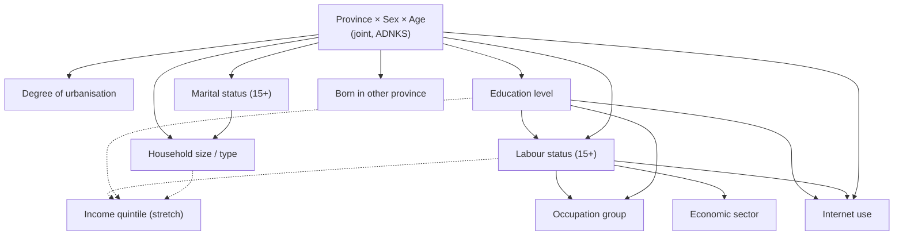

# Türkiye Persona Schema (v1, PROPOSED)

> **Status: PROPOSED.** This schema is a design for instructor and team approval. No data has been downloaded and nothing has been implemented. Every table availability, year, and cross-tabulation marked *verify* must be confirmed in the data-feasibility phase before it is used.

Labels used in this document: **CONFIRMED** (instructor requirement or verified fact), **PROPOSED** (design recommendation), **OPEN DECISION** (needs team or instructor decision), **FUTURE WORK**.

Related documents: [data strategy](data-strategy.md) (sources and access), [validation strategy](validation-strategy.md), [v2 architecture report](societytwin-v2-architecture.md).

## 1. Three levels of representation

SocietyTwin distinguishes three things that are easy to confuse (see [report §3 and §14](societytwin-v2-architecture.md#3-problem-definition)):

| Level | What it is | Created | Uses an LLM? |
|---|---|---|---|
| **Population record** | A lightweight, statistically generated row representing a fictional member of Türkiye's synthetic population | For every member of a population build (for example 1,000,000 rows) | **Never** |
| **Persona** | A richer view of one record: derived descriptors, provenance, and a persona card | On demand, only for records selected into a cohort | Not required (template-based); optional cached LLM narrative is FUTURE WORK |
| **Active AI agent** | A persona temporarily instantiated with an LLM for one experiment trial | Only for the sampled experiment cohort | Yes, one or more calls per trial |

This schema defines the first two levels. Agent instantiation is described in [experiment-system.md](experiment-system.md).

## 2. Design rules

1. **Evidence first.** An attribute is included only if it has a defensible official source, a documented statistical relationship, or a clearly documented modelling assumption.
2. **Small and extensible.** The MVP schema has about a dozen record attributes. MatrAIx uses 1,290 categorical dimensions ([Li et al., 2026](sources.md#reference-systems)); SocietyTwin deliberately does not imitate that size, because most of those dimensions have no Türkiye-specific official source.
3. **Every attribute carries provenance** (section 4), so that users and agents can tell measured structure from modelled structure.
4. **No special-category attributes.** Ethnic origin, religion or sect, political opinion, philosophical belief, health, sexual life, and similar categories listed as special categories of personal data in Türkiye's Personal Data Protection Law No. 6698 (KVKK, Article 6) are **excluded**, even though records are synthetic. Mother tongue is also excluded (section 7).
5. **No names.** Records and personas are identified by codes (for example `TR-06-000123`), never by generated personal names, so that no persona can be mistaken for a real Turkish citizen and name-based stereotyping is avoided. **PROPOSED**
6. **Categorical by default.** Attributes use the official categories of their source (NUTS/İBBS codes, ISCED-based education levels, ISCO-08 major groups, NACE Rev. 2 sections), so that they can be compared directly with published tables.

## 3. Population record schema (MVP candidate attributes)

The **latest year** column gives the most recent release known at the time of writing; all years must be re-checked in the feasibility phase. Geographic levels come from TÜİK's [Official Statistics Programme 2022–2026](sources.md#data-sources) unless marked otherwise.

| # | Attribute | Source | Geographic level | Latest year | Available distribution (expected) | Dependencies (parents) | Limitations | Licence / access | MVP? |
|---|---|---|---|---|---|---|---|---|---|
| 1 | `province` (81, İBBS/NUTS-3) with derived `nuts1`, `nuts2` codes | TÜİK Address Based Population Registration System (ADNKS) | Türkiye, NUTS-1/2/3, district, municipality, village, quarter | 2025 (Türkiye total 86,092,168) | Population by province, sex, and age group (*verify table form*) | Root (joint with sex and age) | Registered usual residence, not de facto location | Public aggregate tables; reuse terms **OPEN DECISION** | Yes |
| 2 | `sex` | ADNKS | as above | 2025 | Province × sex × age group | Root (joint) | Binary administrative category only | as above | Yes |
| 3 | `age` (single year, sampled within published age group) | ADNKS | as above | 2025 | Province × sex × age group; single-year ages at national level (*verify*) | Root (joint) | Single year sampled within group; within-group distribution assumed uniform unless single-year tables are available | as above | Yes |
| 4 | `degree_of_urbanisation` (dense / intermediate / rural) | ADNKS 2025 (density-grid based classification) | Türkiye reported; province-level availability **verify** | 2025 | National shares published (67.2% / 15.5% / 17.2%); province breakdown *verify* | Province (and possibly age) | New classification; sub-national tables not yet confirmed | as above | Yes if province-level table exists, else STRETCH |
| 5 | `marital_status` (age 15+) | TÜİK statistics on marital status based on administrative registers | NUTS-3 | latest annual (*verify*) | By province, sex, age group (*verify*) | Province, sex, age | Defined for 15+ only (*verify age threshold*) | as above | Yes |
| 6 | `education_level` (ISCED-based attainment) | TÜİK National Education Statistics Database (NESD) | NUTS-3, district | latest annual (*verify*) | By province, sex, age group (*verify*) | Province, sex, age | Attainment of the resident population; covered age range *verify* | as above | Yes |
| 7 | `labour_status` (employed / unemployed / not in labour force, 15+) | TÜİK Household Labour Force Survey (HLFS) | Annual: Türkiye, NUTS-1, NUTS-2 | 2025 (*verify*) | By sex, age group, education; regional totals at NUTS-2 (*verify cross-tabs*) | Sex, age, education, NUTS-2 | Sample survey (sampling error); province detail not published; ILO definitions revised in 2021 | Public tables; microdata set available on application | Yes |
| 8 | `occupation_group` (ISCO-08 major group, employed only) | HLFS | Türkiye (regional detail *verify*) | 2025 (*verify*) | By sex and education (*verify*) | Labour status, sex, education | National-level conditional applied to all regions unless regional tables exist | as above | Yes |
| 9 | `economic_sector` (NACE Rev. 2 broad sector, employed only) | HLFS | Türkiye, NUTS-2 (*verify*) | 2025 (*verify*) | Employment by sector and region (*verify*) | Labour status, NUTS-2, sex | Broad sectors only | as above | Yes |
| 10 | `household_size_class` and `household_type` (person-level attributes) | TÜİK household types based on administrative registers | NUTS-3 | latest annual (*verify*) | Households by size and type per province (*verify*); person-level conversion is modelled | Province, age, marital status | MVP describes the household a person lives in; it does **not** build linked households (see §6) | as above | Yes (person-level) |
| 11 | `internet_use_3m` (used the internet in the last 3 months) | TÜİK ICT Usage Survey in Households and by Individuals | NUTS-1 | latest annual (*verify*) | By sex, age group, education, labour status (national, *verify*) and NUTS-1 totals | NUTS-1, sex, age, education, labour status | Survey covers a limited age range (*verify*); regional detail only NUTS-1 | as above | Yes |
| 12 | `born_in_other_province` (place of birth differs from province of residence) | TÜİK statistics on place of birth / place of civil registration (administrative registers) | NUTS-3 | latest annual (*verify*) | Population by province of residence and province of birth (*verify*) | Province, age | Lifetime migration indicator, not recent migration | as above | Yes |
| 13 | `income_quintile` (equivalised household disposable income) | TÜİK Income and Living Conditions Survey (SILC) | Türkiye, NUTS-1, NUTS-2 (cross-sectional) | 2025 (*verify*) | Quintile shares by region; by education or labour status (*verify*) | NUTS-2, education, labour status, household type | Joint conditional not published; requires modelling or microdata | Public tables; microdata set on application | **STRETCH** (**OPEN DECISION**) |
| 14 | `moved_last_year` (internal migration in the last year) | TÜİK internal migration statistics | NUTS-3 | latest annual (*verify*) | In/out migration by province, age, sex (*verify*) | Province, age, sex | Flow statistic; attaching it to persons requires modelling | as above | STRETCH |
| 15 | `citizenship_group` (Turkish citizen / foreign national) | ADNKS (*verify coverage of foreign residents*) and Presidency of Migration Management statistics | *verify* | *verify* | *verify* | Province, age, sex | Coverage of people under temporary protection unclear | **OPEN DECISION** | FUTURE WORK |

**Administrative fields** (not demographic attributes): `record_id`, `build_id`, `weight` (number of residents represented by the record; equal to the reference population divided by N in the MVP), `partition` (NUTS-1 code used for storage).

## 4. Provenance classes

Every attribute value is generated under one provenance class, stored in the schema definition (not per row):

| Class | Meaning | Example |
|---|---|---|
| `OFFICIAL_JOINT` | Sampled directly from an official joint distribution at the stated geography | Province × sex × age group |
| `OFFICIAL_CONDITIONAL` | Sampled from an official conditional table, possibly at a coarser geography, and calibrated to official finer marginals | Education given sex and age, calibrated to provincial education totals |
| `MODELLED` | Combines official tables under a stated assumption, such as conditional independence given parents | Occupation given education and sex, applied to all regions |
| `DERIVED` | Deterministic function of other attributes | NUTS-2 code from province; age group from age |
| `ASSUMED` | Documented assumption with no direct data | Uniform single-year age within a published age group |
| `GENERATED_TEXT` | Persona text produced by a template (or, in future, an LLM); not data | Persona card |

## 5. Dependency model

Attributes are **not** generated independently. The PROPOSED MVP dependency graph is a directed acyclic graph (DAG): parents are generated first, and each child is drawn from its conditional distribution given its parents, following the approach of dependency-graph persona sampling in MatrAIx and conditional (Bayesian-network-style) population synthesis ([Sun & Erath, 2015](sources.md#core-methodology-sources)).

**Generation order (topological):** province × sex × age → degree of urbanisation → marital status → education → labour status → occupation group → economic sector → household size/type → internet use → born in other province → (income quintile, stretch).

The exact parent sets depend on which cross-tabulations TÜİK publishes. Where a child's official table is available only for some parents or only at a coarser geography, the conditional is estimated with iterative proportional fitting (IPF; [Deming & Stephan, 1940](sources.md#core-methodology-sources)) so that it matches every available official marginal. The method is described in [report §11](societytwin-v2-architecture.md#11-synthetic-population-generation).

## 6. Constraints: impossible versus rare

The generator must avoid impossible combinations while preserving legitimate rare cases ([Garrido et al., 2020](sources.md#core-methodology-sources) discuss the rare-combination problem in population synthesis).

- **Hard constraints (structural zeros)** come only from definitions, never from expectations about what is "typical". Examples (PROPOSED, thresholds to verify against source definitions):
  - `marital_status` and `labour_status` are *not applicable* below the age threshold used by their source tables.
  - `occupation_group` and `economic_sector` apply only to employed persons.
  - An education level cannot be completed before the minimum age implied by the official school entry age and programme duration (threshold documented per level).
- **Soft constraints** describe combinations that are unusual but possible (for example, an employed person aged 75, or a single-person household at age 18). They are **not** masked. Their frequencies are left to the data and monitored in validation.
- The hard-constraint violation rate is a validation metric and must be zero ([validation-strategy.md](validation-strategy.md#2-conditional-consistency)).

## 7. Attributes deliberately excluded

| Excluded attribute | Reason |
|---|---|
| Ethnic origin, religion or sect, political opinion, philosophical belief, health, sexual life, union membership | Special categories under KVKK Article 6; high risk of stereotyping; not appropriate for synthetic personas |
| Mother tongue / language | Not in current official population statistics as far as the team has found; sensitive in the Turkish context. The **interaction language** of an experiment (for example Turkish) is an experiment setting, not a persona attribute. **OPEN DECISION** |
| Personality, values, preferences, lifestyle | No Türkiye-specific official source at record level; possible FUTURE WORK only when grounded in a licensed survey and validated |
| Names, addresses, identifiers resembling real ones | Privacy and misrepresentation risk |

## 8. Persona layer (level 2)

A persona is a **view** of one population record. It adds no new random attributes in the MVP.

| Persona field | Content | Provenance |
|---|---|---|
| `persona_id` | `build_id` + `record_id` | `DERIVED` |
| Descriptors | Age group, life stage (derived from age, marital status, and labour status), region names | `DERIVED` |
| Attribute provenance | Provenance class of each attribute (section 4) | Schema metadata |
| Persona card | Short text rendered from a versioned template, for example: "You are a 34-year-old woman living in an urban area of Ankara (TR51). You completed upper secondary education and are employed in a service-sector job…" | `GENERATED_TEXT` (template) |
| Unknowns statement | An explicit list of what is **not** modelled ("Your religion, political views, income, and personality are not specified. Do not assume them.") | Template |

**FUTURE WORK:** survey-grounded dispositions (for example life-satisfaction level from TÜİK's Life Satisfaction Survey, or values from licensed international surveys) may be added only when their source, conditional distribution, and validation test are documented in this schema.

## 9. Versioning

- The schema is versioned (`schema_version`, starting at `tr-persona-1`). Any change to attributes, categories, parents, or constraints creates a new version.
- Every population build records the schema version, data-manifest version, generator version, seed, and size ([report §20](societytwin-v2-architecture.md#20-reproducibility)).
