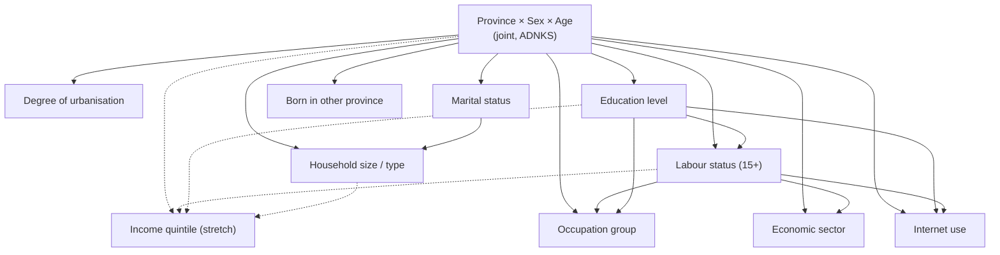

# Türkiye Persona Schema `tr-persona-1` (PROPOSED)

> **Status: PROPOSED.** This schema is a design for instructor and team approval. No data has been downloaded and nothing is implemented. Not every attribute is currently obtainable from TÜİK in the needed form; each attribute's data status is stated explicitly (section 3.1).

Related documents: [data strategy](data-strategy.md) (sources and access), [validation strategy](validation-strategy.md), [v2 architecture report](societytwin-v2-architecture.md) (dependency-aware generation: sections 10–11).

## 1. Three levels of representation

| Level | What it is | Created | Uses an LLM? |
|---|---|---|---|
| **Population record** | A lightweight, statistically generated row representing a fictional member of Türkiye's synthetic population | For every member of a population build (build size is configurable; benchmark scales 10K, 100K, 1M) | **Never** |
| **Persona** | A richer view of one record: derived descriptors, provenance, and a persona card | On demand, only for records selected into a cohort | Not required (template-based); an optional cached LLM narrative is FUTURE WORK |
| **Active AI agent** | A persona temporarily instantiated with an LLM for one experiment trial | Only for the sampled experiment cohort, within the budget | Yes |

This document defines the first two levels. Agent instantiation is described in [experiment-system.md](experiment-system.md).

## 2. Design rules

1. **Türkiye-specific evidence.** An attribute is included only if it has a defensible TÜİK (or other official) source, a documented statistical relationship, or a clearly documented modelling assumption.
2. **Small, tiered, extensible.** Six core attributes are required for the MVP; six more are added if their data is confirmed. SocietyTwin does not imitate the 1,290-dimension schema of MatrAIx ([Li et al., 2026](sources.md#reference-systems)).
3. **Provenance for every attribute** (section 4), so that measured structure can be told apart from modelled structure.
4. **No special-category attributes.** The special categories of personal data in Law No. 6698 (KVKK), Article 6, are excluded even as synthetic attributes (section 7).
5. **No names.** Records and personas are identified by codes (for example `TR-06-000123`), never by generated personal names. **PROPOSED**
6. **Official categories.** Attributes use the categories of their source (İBBS codes, ISCED-based education levels, ISCO-08 major groups, NACE Rev. 2 sections), so that they can be compared directly with published tables.

## 3. Population record schema (MVP candidate attributes)

### 3.1 Status and tier legend

| Data status | Meaning |
|---|---|
| **CONFIRMED DATA** | The official statistic and its geographic level are verified in a primary TÜİK source; the exact table layout is still checked in the feasibility phase |
| **CANDIDATE DATA** | The official statistic exists at the stated level (verified in TÜİK's Official Statistics Programme), but the cross-tabulation needed for this attribute's dependencies has **not** been verified |
| **PROPOSED** | A derived or administrative field proposed by the design |
| **OPEN DECISION** | Data availability, method, or appropriateness requires a team or instructor decision |

| MVP tier | Meaning |
|---|---|
| **Core** | Required for MVP success |
| **Target** | In the MVP if its data is confirmed |
| **Stretch** | Beyond the MVP |
| **Future** | Later work |

Reuse terms for TÜİK portal tables are an **OPEN DECISION** for all TÜİK-based attributes ([data-strategy.md](data-strategy.md)).

### 3.2 Data sources and status

| # | Attribute | Source | Year | Geographic resolution | Data status | Tier | Limitations |
|---|---|---|---|---|---|---|---|
| 1 | `province` (81 provinces, İBBS NUTS-3) | ADNKS | 2025 (Türkiye total 86,092,168) | Province; district and below also published | CONFIRMED DATA | Core | Registered usual residence |
| 2 | `sex` | ADNKS | 2025 | Province | CONFIRMED DATA | Core | Binary administrative category only |
| 3 | `age` | ADNKS | 2025 | Province (by age group) | CONFIRMED DATA | Core | Published in age groups at province level; single years sampled within groups |
| 4 | `degree_of_urbanisation` (dense / intermediate / rural) | ADNKS 2025 | 2025 | National shares published; province level *verify* | CANDIDATE DATA | Target | New classification; sub-national tables not confirmed |
| 5 | `marital_status` (adults) | TÜİK marital status statistics (administrative registers) | latest annual (*verify*) | NUTS-3 | CANDIDATE DATA | Core | Age threshold and cross-tabulation with age and sex *verify* |
| 6 | `education_level` (ISCED-based attainment) | National Education Statistics Database | latest annual (*verify*) | NUTS-3, district | CANDIDATE DATA | Core | Covered age range and cross-tabulation *verify* |
| 7 | `labour_status` (employed / unemployed / not in labour force; 15+) | Household Labour Force Survey | 2025 (*verify*) | Türkiye, NUTS-1, NUTS-2 (annual) | CANDIDATE DATA | Core | Sample survey; no province detail; ILO definitions revised in 2021 |
| 8 | `occupation_group` (ISCO-08 major group; employed) | Household Labour Force Survey | 2025 (*verify*) | Türkiye; regional detail *verify* | CANDIDATE DATA | Target | National conditional may have to be applied to all regions |
| 9 | `economic_sector` (NACE Rev. 2 broad sector; employed) | Household Labour Force Survey | 2025 (*verify*) | Türkiye, NUTS-2 (*verify*) | CANDIDATE DATA | Target | Broad sectors only |
| 10 | `household_size_class`, `household_type` (person-level) | TÜİK household type statistics (administrative registers) | latest annual (*verify*) | NUTS-3 | CANDIDATE DATA | Target | Published per household; conversion to persons is modelled; no linked households in the MVP |
| 11 | `internet_use_3m` (used the internet in the last 3 months) | ICT Usage Survey in Households and by Individuals | latest annual (*verify*) | NUTS-1 | CANDIDATE DATA | Target | Survey age range *verify*; regional detail only NUTS-1 |
| 12 | `born_in_other_province` (yes / no) | TÜİK place-of-birth statistics (administrative registers) | latest annual (*verify*) | NUTS-3 | CANDIDATE DATA | Target | Lifetime migration only |
| 13 | `income_quintile` | Income and Living Conditions Survey (SILC) | 2025 (*verify*) | Türkiye, NUTS-1, NUTS-2 | OPEN DECISION | Stretch | Joint conditional not published; modelling or microdata needed |
| 14 | `moved_last_year` | TÜİK internal migration statistics | latest annual (*verify*) | NUTS-3 | CANDIDATE DATA | Stretch | Flow statistic; attaching it to persons is modelled |
| 15 | `citizenship_group` | ADNKS / Presidency of Migration Management (*verify*) | *verify* | *verify* | OPEN DECISION | Future | Coverage of people under temporary protection unclear; sensitive |

**Administrative fields (PROPOSED):**
- `record_id` and `build_id`;
- `weight`, the number of residents represented by the record: the ADNKS reference population divided by N, for example about 86 at N = 1M;
- `nuts1` and `nuts2`, derived from the province;
- `partition`, the NUTS-1 storage partition.

### 3.3 Modelling, validation, and privacy

| # | Attribute | Dependencies (parents) | Generation method | Validation method | Privacy / ethical concern |
|---|---|---|---|---|---|
| 1–3 | `province`, `sex`, `age` | Root: joint province × sex × age group | Controlled-rounding allocation of N records to ADNKS cells; single-year age sampled within group (`ASSUMED` uniform unless single-year tables exist) | Allocation totals match ADNKS (up to rounding); TVD per province | Low for records; regional, gender, and age stereotypes possible in persona agents (stereotype audit) |
| 4 | `degree_of_urbanisation` | Province | Conditional sampling from a province table if available | Source-table fit | Urban/rural stereotyping in prompts |
| 5 | `marital_status` | Province, sex, age | Conditional sampling; IPF to provincial marginals; not applicable below the source age threshold (hard constraint) | Source-table fit; constraint check; held-out table if available | Family-norm stereotyping |
| 6 | `education_level` | Province, sex, age | Conditional sampling; IPF to provincial marginals; minimum completion age per level (hard constraint) | Source-table fit; constraint check; held-out cross-tabulations (for example with labour status) where available | Status stereotyping |
| 7 | `labour_status` | Sex, age, education, NUTS-2 region | National cross-tabulation calibrated by IPF to NUTS-2 marginals; not applicable below 15 | Source-table fit at NUTS-2; held-out cross-tabulations; constraint check | Stigma around unemployment |
| 8 | `occupation_group` | Labour status, sex, education | Conditional sampling for employed persons; national conditional applied to all regions unless regional tables exist (`MODELLED`) | Source-table fit; Cramér's V difference for education–occupation | Gendered occupational stereotypes |
| 9 | `economic_sector` | Labour status, sex, NUTS-2 region | Conditional sampling for employed persons | Source-table fit at NUTS-2 | Low |
| 10 | `household_size_class`, `household_type` | Province, age, marital status | Person-level probabilities derived from household tables (`MODELLED`) | Fit to household-type shares after conversion; documented assumptions | Family-structure stereotyping |
| 11 | `internet_use_3m` | NUTS-1 region, sex, age, education, labour status | National breakdowns combined with NUTS-1 totals by IPF | Source-table fit at NUTS-1 | Digital-divide stereotyping (age, rural) |
| 12 | `born_in_other_province` | Province, age | Conditional sampling from place-of-birth tables | Source-table fit | Could act as a proxy for ethnic or regional origin together with province: kept as yes/no only, and the birth province is never generated or shown |
| 13 | `income_quintile` | NUTS-2 region, education, labour status, household type | Modelled from published tables, or learned from microdata if access is granted | Source-table fit; held-out tables | Socioeconomic stereotyping; perceived as sensitive |
| 14 | `moved_last_year` | Province, age, sex | Migration rates attached to persons (`MODELLED`) | Fit to flow totals | Low |
| 15 | `citizenship_group` | Province, age, sex | Not defined | Not defined | Migration and refugee status is sensitive; not included without explicit approval |

## 4. Provenance classes

Every attribute is generated under one provenance class, stored in the schema definition:

| Class | Meaning | Example |
|---|---|---|
| `OFFICIAL_JOINT` | Sampled directly from an official joint distribution at the stated geography | Province × sex × age group |
| `OFFICIAL_CONDITIONAL` | Sampled from an official conditional table, possibly at a coarser geography, and calibrated to official finer marginals | Education given sex and age, calibrated to provincial totals |
| `MODELLED` | Combines official tables under a stated assumption, such as conditional independence given parents | Occupation given education and sex, applied to all regions |
| `DERIVED` | Deterministic function of other attributes | NUTS-2 code from province; age group from age |
| `ASSUMED` | Documented assumption with no direct data | Uniform single-year age within a published age group |
| `GENERATED_TEXT` | Persona text produced by a template (or, in future, an LLM); not data | Persona card |

## 5. Dependency model

Attributes are generated along a directed acyclic graph (DAG): parents first, then each child from its conditional distribution given its parents. This follows dependency-graph persona sampling in MatrAIx and conditional (Bayesian-network-style) population synthesis ([Sun & Erath, 2015](sources.md#synthetic-population-research)). Why this matters is explained in [report §10](societytwin-v2-architecture.md#10-dependency-model).

The graph shows core and target attributes; the dashed edges lead to the stretch attribute income quintile. `moved_last_year` (stretch) would depend on the root node only.

**Generation order (topological):** province × sex × age → degree of urbanisation → marital status → education → labour status → occupation group → economic sector → household size/type → internet use → born in other province → (income quintile, stretch).

The root node supplies different parts of itself to different children (for example the province to urbanisation, the NUTS-2 region to labour status and sector, the NUTS-1 region to internet use, and sex and age to most attributes). The exact parent sets depend on which cross-tabulations TÜİK publishes. Where a child's table is available only for some parents or only at a coarser geography, the conditional is fitted with IPF ([Deming & Stephan, 1940](sources.md#core-methodology)) so that it matches every available official marginal.

## 6. Constraints: impossible, measured, and assumed

| Kind | Rule | Examples |
|---|---|---|
| **Hard constraints** (structural zeros) | From definitions only, never from expectations about what is "typical" | `labour_status` and `marital_status` are *not applicable* below the age thresholds of their source tables; `occupation_group` and `economic_sector` apply only to employed persons; an education level cannot be completed before the minimum age implied by the official school entry age and programme duration |
| **Statistical dependencies** | Measured in official tables | The parent sets in section 5 |
| **Modelling assumptions** | Documented, tested where possible | Conditional independence given parents; national conditionals applied to regions; uniform single-year ages; person-level household attributes |

**Soft constraints** (unusual but possible combinations, such as an employed person aged 75 or a single-person household at age 18) are **not** masked, so that legitimate rare cases survive ([Garrido et al., 2020](sources.md#synthetic-population-research)). They are monitored in validation. The hard-constraint violation rate must be zero ([validation-strategy.md](validation-strategy.md#2-conditional-consistency-evidence-b)).

## 7. Attributes deliberately excluded

| Excluded attribute | Reason |
|---|---|
| Race, ethnic origin, political opinion, philosophical belief, religion, religious sect or other belief, appearance, membership of associations, foundations or trade unions, health, sexual life, criminal convictions and security measures, biometric and genetic data | Special categories of personal data under KVKK Article 6; high risk of stereotyping |
| Mother tongue / language | Not in current official population statistics as far as the team has found; sensitive in the Turkish context. The **interaction language** of an experiment (for example Turkish) is an experiment setting, not a persona attribute. **OPEN DECISION** |
| Birth province (as a named value) | Could act as a proxy for ethnic or regional origin; only the yes/no attribute `born_in_other_province` is considered |
| Personality, values, preferences, lifestyle | No Türkiye-specific official source at record level; possible FUTURE WORK only if grounded in a licensed survey and validated |
| Names, addresses, identifiers resembling real ones | Privacy and misrepresentation risk |

## 8. Persona layer (level 2)

A persona is a **view** of one population record. It adds no new random attributes in the MVP.

| Persona field | Content | Provenance |
|---|---|---|
| `persona_id` | `build_id` + `record_id` | `DERIVED` |
| Descriptors | Age group, life stage (from age, marital status, and labour status), region names | `DERIVED` |
| Attribute provenance | Provenance class and data status of each attribute | Schema metadata |
| Persona card | Short text rendered from a versioned template, for example: "You are a 34-year-old woman living in an urban area of Ankara (TR51). You completed upper secondary education and are employed in a service-sector job…" | `GENERATED_TEXT` (template) |
| Unknowns statement | An explicit list of what is **not** modelled ("Your religion, political views, income, and personality are not specified. Do not assume them.") | Template |

**FUTURE WORK:** survey-grounded dispositions (for example life-satisfaction level from TÜİK's Life Satisfaction Survey) may be added only when their source, conditional distribution, and validation test are documented here.

## 9. Versioning

- The schema is versioned (`schema_version`, starting at `tr-persona-1`), and so is the persona card template. Any change to attributes, categories, parents, constraints, or card wording creates a new version.
- Every population build records the schema version, data-manifest version, generator version, seed, and size ([report §20](societytwin-v2-architecture.md#20-reproducibility)).
