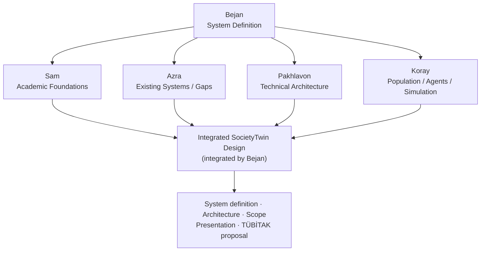

# Research integration

This document explains how the team's five research streams come together into one SocietyTwin design. Roles and deliverables are listed in [team-responsibilities.md](team-responsibilities.md).

## Structure



1. **Bejan** (Project Manager / System Architect) sets the initial system definition: the objective, main problem, and boundaries that the research streams work within.
2. **Sam, Azra, Pakhlavon, and Koray** each research one part of the system.
3. **Bejan** integrates their outputs into the final SocietyTwin design and the documents built from it.

## What each research stream contributes

| Research stream | Question it answers | Output | Feeds into |
|---|---|---|---|
| Sam: Academic Foundations | What does the research literature say about digital twins, social simulation, synthetic populations, and agents? | Reviewed sources ([sources.md](sources.md)) | Theoretical basis for the system definition; references for the presentation and TÜBİTAK proposal |
| Azra: Existing Systems / Gaps | What systems already exist, and what can they not do? | Comparison of existing systems | The gap SocietyTwin addresses and its stated contribution |
| Pakhlavon: Technical Architecture | How could SocietyTwin be built, and why does it need each technology? | Justified technology assessment | Technical side of the architecture; tools listed in `requirements.txt` |
| Koray: Population / Agents / Simulation | How will the population, agents, simulation, and evaluation work? | Population Schema + Agent Schema + Simulation Concept | Agent / Society Model, Scenario Manager, Simulation Engine, and Evaluation stages of the architecture |

## Integrated outputs

The Project Manager / System Architect combines the research outputs into:

| Output | Main inputs |
|---|---|
| Final system definition (objective, target users, problem, boundaries, capabilities) | All streams |
| Architecture ([architecture.md](architecture.md), currently preliminary) | Pakhlavon, Koray |
| Scope ([project-overview.md](project-overview.md#in-scope)) | All streams, especially Azra's gap analysis |
| Presentation | All streams; at least 5 sources selected from Sam's list |
| TÜBİTAK proposal | All streams, especially Sam's sources and Azra's gap and contribution |

## From existing work to contribution

Azra's and Sam's research together should support a clear argument for the presentation and the TÜBİTAK proposal:

```text
Existing Work               (Azra: existing systems; Sam: literature)
      ↓
Existing Limitation / Gap
      ↓
Our Contribution            (integrated by Bejan into the system definition)
```

This argument has not been written yet. It depends on the research outputs above.

## Status

All research streams are in the research phase. This document describes how the outputs will be combined; it does not record any research findings.
