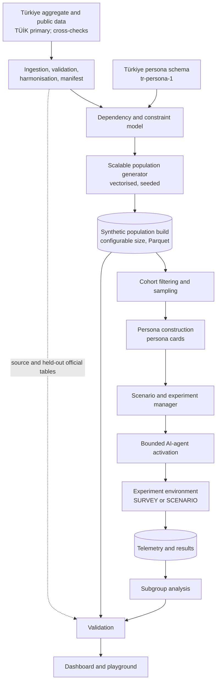
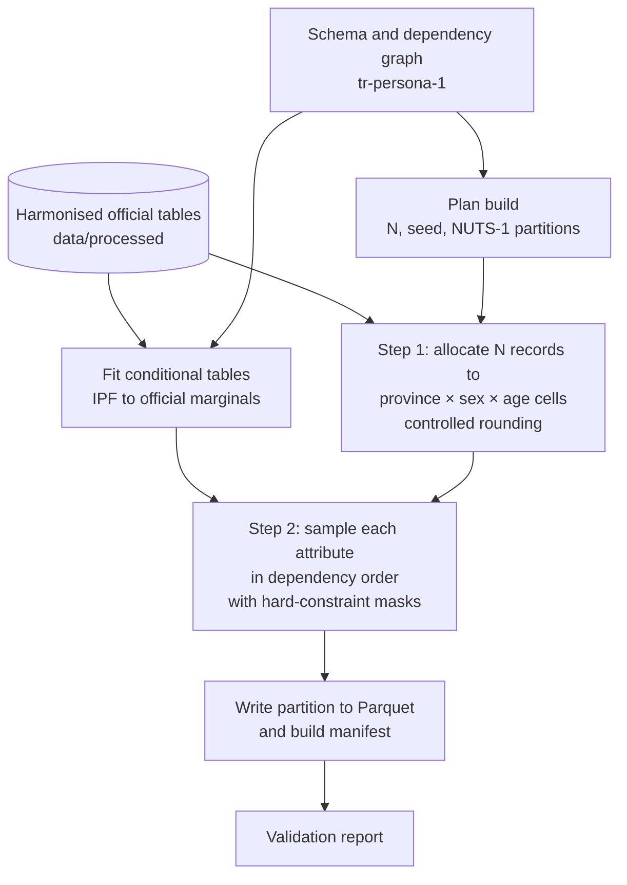
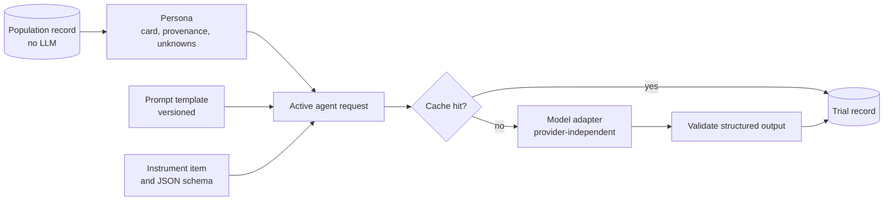
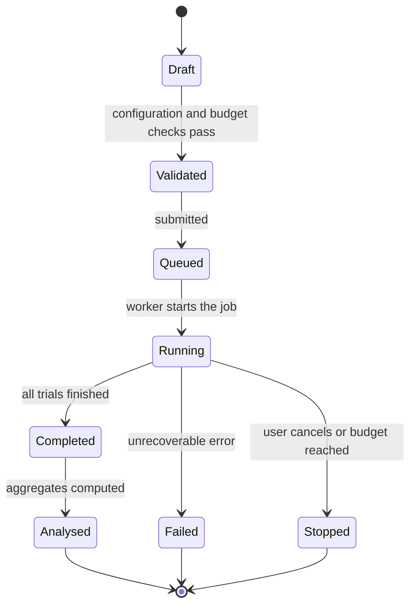
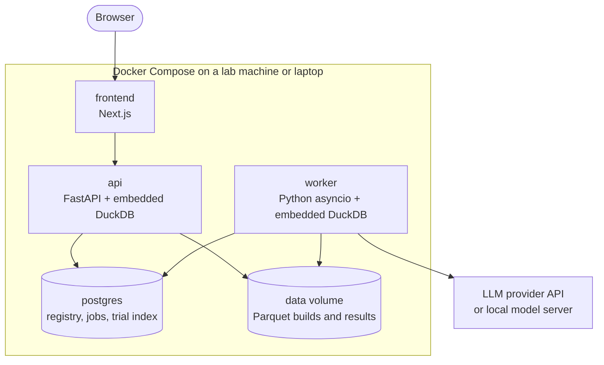

# SocietyTwin v2 Architecture Report

**A Türkiye-only, large-scale, data-grounded synthetic society platform**

| Field | Detail |
|---|---|
| Project | Engineering Design II: SocietyTwin — AI-Powered Digital Society Twin for Türkiye |
| Document status | **PROPOSED** architecture. The overall direction is approved for refinement; specific decisions still need instructor and team approval. |
| Supersedes | Final Technical Architecture v1.0 (5,000-agent demographic prototype), archived in [archive/architecture-v1-demographic.md](archive/architecture-v1-demographic.md) |
| Implementation status | Not started. The repository contains documentation and placeholder folders only. |

**Labels.**
- **CONFIRMED:** a confirmed instructor requirement or a verified fact.
- **PROPOSED:** a design recommendation in this report.
- **OPEN DECISION:** requires an instructor or team decision.
- **FUTURE WORK:** outside the semester MVP.

**Decision format.** Each major decision (D-01 to D-17) is recorded with its **Decision**, **Reason**, **Alternatives**, **Trade-off**, and **Status**.

---

## 1. Executive Summary

SocietyTwin v2 is a research platform designed around Türkiye. It will:

1. generate a synthetic population of Türkiye from official aggregate statistics, primarily from TÜİK (Turkish Statistical Institute);
2. validate that the population reproduces the published Turkish distributions and the dependencies between attributes;
3. sample cohorts from it and construct personas;
4. instantiate a small number of sampled personas as AI agents in reproducible survey and scenario experiments.

**Population scale is configurable.** Builds can be generated at any size. The architecture is benchmarked at **10K, 100K, and 1M records** and can grow beyond that. The final target size will be set from the instructor's requirements, the available data, and benchmark results (**OPEN DECISION**). 1M is **PROPOSED** as the largest MVP benchmark and as a recommended working scale for province-level analysis (section 12).

The central design rule is a strict separation of three levels:

| Level | What it is | Uses an LLM? |
|---|---|---|
| **Population record** | A lightweight, statistically generated fictional member of Türkiye's synthetic population | Never |
| **Persona** | A richer view of a record selected into a cohort: descriptors, provenance, persona card | No (template-based) |
| **Active AI agent** | A persona temporarily instantiated with an LLM for one experiment trial | Yes, bounded by the experiment budget |

**Population size and the number of active AI agents are independent.** LLM cost grows with the experiment cohort, not with the population.



**Primary contribution (PROPOSED).** An engineering and research contribution combining:

- a **Türkiye-specific**, statistically grounded synthetic population and persona layer, generated at configurable scale from TÜİK statistics with **dependency-aware generation**;
- **controlled, reproducible AI-enabled experiments** on sampled cohorts;
- **transparent validation** at five levels.

No claim of novelty is made until the literature review is complete (section 7.1).

**What changes from v1.** The 5,000-agent limit, the 60-second 5,000 × 10-year target, the demographic-only agent schema, and the ABM vs Cohort-Component / Matrix Projection vs ML comparison as the main research question are superseded (section 2). Useful v1 work is preserved (section 17).

---

## 2. Instructor Feedback / Motivation for v2

### Confirmed feedback (CONFIRMED)

- SocietyTwin must focus on **Türkiye only**.
- **5,000 synthetic agents is too small**. The system should support a **substantially larger** population, and the architecture must be **scalable**.
- **Large-scale synthetic-persona systems such as MatrAIx** are an important inspiration for SocietyTwin's capabilities.

The instructor has **not** specified a target population size, an environment set, or a model provider. These are OPEN DECISIONS (section 35).

### Source priority

When sources conflict, this report follows:
1. confirmed instructor feedback;
2. the latest project and proposal requirements that do not conflict with it;
3. the latest technical architecture (v1.0);
4. existing GitHub documentation;
5. older planning documents.

### Contradictions with earlier documents

| Topic | Earlier documents | v2 | Status |
|---|---|---|---|
| Population size | Exactly 5,000 agents (SRS FR-02, TC-01; TÜBİTAK proposal as summarised to the team) | Configurable builds; benchmark scales 10K, 100K, 1M; final target set later | Scalability CONFIRMED; benchmark scales PROPOSED; final size OPEN DECISION |
| Performance target | 5,000 agents × 10 years in under 60 s (NFR-02, TC-10) | Separate benchmark dimensions for generation, storage/query, simulation, and AI activation; no targets before benchmarking | PROPOSED; targets OPEN DECISION |
| Main research question | ABM vs Cohort-Component / Matrix Projection vs ML comparison | Scalable, statistically grounded Türkiye population and persona generation with validated, reproducible AI-enabled experiments (section 5) | PROPOSED; proposal alignment OPEN DECISION |
| Role of LLMs | Excluded from the core simulation | Used only for sampled personas activated as agents; never used to generate population statistics | Persona capabilities CONFIRMED as a direction; LLM scope PROPOSED |
| Agent schema | Seven demographic fields | Evidence-backed schema `tr-persona-1` with provenance and status per attribute | PROPOSED |
| Main engine | Mesa-based ABM | Vectorised generator; Mesa optional for small interaction experiments | PROPOSED |
| Data | TÜİK demographic tables | TÜİK population, education, labour, household, and ICT statistics | PROPOSED |

The TÜBİTAK 2209-B proposal text is not stored in this repository. Whether it can be revised to the new research question is an **OPEN DECISION**.

---

## 3. Problem Definition

Researchers and students who want to explore how different groups in Türkiye might respond to a question or a hypothetical situation face three problems:

1. **Real studies are slow and costly**, and real individuals' data is protected.
2. **Existing synthetic-persona systems are not built around Turkish official statistics.** MatrAIx, for example, is an infrastructure for evaluating AI systems and digital products with simulated users; its synthetic records are calibrated to broad published statistics such as age bracket, region, gender identity, and urbanicity ([Li et al., 2026](sources.md#reference-systems)).
3. **LLM-based simulated respondents are unreliable without grounding and validation.** They can misportray and flatten identity groups ([Wang et al., 2025](sources.md#persona-and-llm-research)), behave like an "average persona" ([Wu et al., 2026](sources.md#validation-research)), and change results under small prompt perturbations ([Ye et al., 2026](sources.md#validation-research)).

SocietyTwin v2 addresses a narrower, testable problem: **build a synthetic population of Türkiye whose statistical properties are traceable to TÜİK statistics and measurably validated, and provide a reproducible way to sample from it and run bounded AI-persona experiments whose limitations are explicit.**

### Definitions

| Term | Definition |
|---|---|
| **Population record** | A lightweight, statistically generated record representing a fictional member of Türkiye's synthetic population. Contains only attributes with a defensible source, statistical relationship, or documented assumption. |
| **Persona** | A richer representation constructed from one population record: descriptors, provenance, and a persona card. |
| **Active AI agent** | A persona temporarily instantiated with an LLM (or another reasoning model) to take part in one experiment trial. |
| **Population build** | One generated population, identified by schema version, data-manifest version, generator version, seed, and size. |
| **Cohort** | A filtered and sampled set of records from one build, used by an experiment. |
| **Trial** | One active agent completing one item in one environment. |

---

## 4. Scope

**In scope (PROPOSED for the semester):**
- Türkiye aggregate data ingestion.
- A versioned persona schema.
- Dependency-aware population generation at configurable scale.
- Statistical validation.
- Cohort sampling and persona construction.
- SURVEY and SCENARIO experiments with bounded AI activation.
- Telemetry, subgroup analysis, and reproducibility.
- A basic web playground.

**Out of scope:**
- Any country other than Türkiye (CONFIRMED).
- Predicting the behaviour of real individuals.
- Identifying or reconstructing real people.
- Special-category attributes (section 25).
- Running an LLM for every stored record.
- Claims that personas represent real Turkish citizens.
- Web and app agent environments in the MVP.
- Production cloud deployment.


---

## 5. Research Questions

All research questions are **PROPOSED** until approved by the instructor.

**Primary research question.** To what extent can a synthetic population of Türkiye, generated at configurable scale solely from official aggregate statistics, reproduce the distributions and attribute dependencies published by TÜİK, and how consistently and reproducibly can personas constructed from it be used in controlled AI-enabled experiments?

**Secondary research questions.**

1. **Dependency-aware generation.** How much does dependency-aware generation (conditional sampling with IPF-fitted conditionals and hard constraints) reduce error on held-out TÜİK cross-tabulations compared with independent-attribute sampling?
2. **Scale.** How do statistical fidelity (especially for small provinces) and the costs of generation, storage, querying, and sampling change across the benchmark scales of 10K, 100K, and 1M records?
3. **Persona consistency.** How consistently do AI agents constructed from population records express their assigned attributes across repeated runs, prompt perturbations, and (budget permitting) different models?
4. **Experiment validity and reproducibility.** For survey items with published Turkish aggregates that were not used in generation, how close are subgroup response distributions of persona agents to the real aggregates compared with simple baselines, and how exactly can experiments be reproduced?

**Evaluation hypotheses** (expectations to test, not claims):

- **H1.** Dependency-aware generation has lower held-out conditional error than the independent-sampling ablation.
- **H2.** Province-level marginal error decreases as the build size increases; the smallest provinces need large builds for stable estimates.
- **H3.** Persona adherence is higher for directly stated attributes than for behaviours that must be inferred from them.
- **H4.** Persona-agent responses show lower within-subgroup variance than real survey data, as reported in the literature for LLM simulations.

#### D-17 · Research question

| Field | Detail |
|---|---|
| **Decision** | Replace the v1 model-comparison question with the question above. |
| **Reason** | The v1 question was built around a 5,000-agent demographic prototype that the instructor has superseded; the new question matches the confirmed direction and can be answered with measurable validation within a semester. |
| **Alternatives** | Keep the v1 question and add personas; adopt a product-evaluation question like MatrAIx's. |
| **Trade-off** | The TÜBİTAK proposal's questions may need revision. The v1 engines remain available as supporting components (section 17). |
| **Status** | PROPOSED; proposal alignment OPEN DECISION |

---

## 6. Design Principles

1. **Türkiye first.** Every population attribute is traced to Turkish official statistics or a documented assumption.
2. **Evidence before breadth.** Only attributes with an official source or documented assumption are included.
3. **Separate population scale from AI scale.** Records are cheap; AI agents are expensive and bounded.
4. **Validation is part of the product.** Every build and experiment produces a validation report.
5. **Reproducible by construction.** Every artefact is traceable to data, configuration, code version, model, and seed.
6. **Population-level only.** No individual-level prediction; no real-person representation.
7. **Simplest architecture that meets the requirements.** One machine, in-process analytics, one worker; add distribution only when measurements require it.
8. **Provider independence and explicit uncertainty.** No lock-in to one LLM provider; results carry intervals, variance, and limitations.

### 6.1 Technology stack (PROPOSED)

All rows are PROPOSED. Versions will be pinned when implementation starts.

| Layer | Choice | Why it is needed | Alternatives considered | Trade-off |
|---|---|---|---|---|
| Language | Python 3.12 (3.11 minimum) | One language for data, generation, analysis, API, and LLM calls | Python 3.11 (v1 target) | Team machines need upgrading (at least one currently has Python 3.9) |
| Arrays | NumPy | Vectorised categorical sampling for large builds | Pure Python loops | – |
| Small tables | pandas | Reading and harmonising TÜİK tables; IPF on small tables | Polars | Slower on very large tables, but only used on small ones |
| Columnar format | PyArrow + Parquet | Compressed, typed, partitioned storage readable by DuckDB and pandas | CSV; database tables | Binary files need tools to inspect |
| Analytics | DuckDB (embedded) | SQL filtering, sampling, and aggregation directly on Parquet, with no server | PostgreSQL for analytics; Spark | Single-process engine |
| Metadata and jobs | PostgreSQL (SQLite for local development and tests) | Concurrent writes from API and worker; transactions; a simple durable job queue | SQLite only; Redis + Celery or RQ | One more container |
| Statistics | SciPy (selectively) | Distribution metrics such as Jensen–Shannon distance | Hand-written metrics | – |
| Validation | Pydantic | Schema, configuration, API models, structured-output validation | Hand-written checks | – |
| API | FastAPI | Typed endpoints, OpenAPI documentation, native Pydantic support | Flask | – |
| LLM access | Thin in-house adapter over provider SDKs or HTTP | Provider independence, testability, full control of logging and caching | LangChain; LiteLLM | Adapters must be maintained per provider |
| Frontend | Next.js + TypeScript | Multi-page UI with a typed API client (continuity with v1) | React with Vite | Heavier than strictly necessary |
| Charts | Recharts | Distribution and subgroup charts | Plotly | Maps need an extra library (STRETCH) |
| Testing | pytest, Hypothesis, Vitest | Unit, property-based, and frontend tests | – | – |
| Packaging | `pyproject.toml` with a lockfile (uv suggested) | Reproducible environments | pip + requirements.txt | New tool for the team |
| Infrastructure | Docker Compose, GitHub Actions | One command to run the stack; CI on every pull request | Cloud deployment | Local or lab machine only; no cloud provider chosen |
| Agent-based modelling | Mesa: **not in the MVP core** | Only for small rule-based interaction experiments | mesa-frames | See D-08 |

---

## 7. Reference Systems

SocietyTwin is **inspired by architectural ideas from large-scale synthetic persona systems such as MatrAIx**. It is not a MatrAIx clone; it is a separate, Türkiye-specific academic project.

| System | What it is | Ideas SocietyTwin takes as inspiration | Not adopted |
|---|---|---|---|
| **MatrAIx / Persona-8B** ([Li et al., 2026](sources.md#reference-systems)) | Population-scale simulated-user evaluation infrastructure for AI systems and digital products: 8.3 billion persona records over 1,290 categorical dimensions, a released ~1M coreset, Survey / AI Chatbot / Web / App environments, 18,189 evaluation trials | Dependency-graph sampling with compatibility masks; records separate from LLM-powered agents; cohort selection from a larger pool; per-trial telemetry (persona, task, agent, model, seed); run manifests with requested and realised cohort; persona-adherence tests; cross-model checks; Survey-type environment | Schema size; billions of records; persona extraction from web sources; Web and App environments in the MVP; the product-evaluation purpose |
| **MatrAIx grounding position paper** ([MatrAIx Research Community, 2026](sources.md#validation-research)) | Argues synthetic personas need explicit grounding and standardised reporting; six-item checklist | The checklist in every validation report | – |
| **MIT Social Simulation Arena** ([Social Atoms at MIT](sources.md#reference-systems)) | Live benchmark: entrants forecast how a population will answer polls or behave before the data is released; forecasts are locked, hashed, and scored (CRPS, energy score, rank-biased overlap) | Pre-registered, locked predictions scored against later real releases (FUTURE WORK); proper scoring rules | Competition infrastructure |
| **SimBench** ([Hu et al., 2026](sources.md#validation-research)) | Benchmark of group-level human-behaviour simulation across 20 datasets; best models reach a modest score (40.80/100) | Group-level distribution comparison; realistic expectations | – |
| **Generative agents** ([Park et al., 2023](sources.md#reference-systems); [Park et al., 2024](sources.md#persona-and-llm-research)) | LLM agents with memory, planning, and reflection; agents grounded in interviews of 1,052 people outperform demographic-only baselines | Demographic-only baselines; honesty about what demographic-only grounding can achieve | Interview-grounded agents (no real-person data is used) |
| **AgentSociety** ([Piao et al., 2025](sources.md#reference-systems)) | LLM-driven social simulator with over 10,000 agents | Evidence of the cost of large LLM societies | Large interacting LLM societies in the MVP |
| **AgentTorch / LLM archetypes** ([Chopra et al., 2024](sources.md#reference-systems)) | Millions of agents grouped into LLM "archetypes" | Archetypes as FUTURE WORK for population-wide AI behaviour | – |
| **SynthPop++** ([Neekhra et al., 2023](sources.md#reference-systems)) | Hybrid country-scale synthetic population combining multiple surveys (India) | Feasibility of country-scale multi-survey synthesis | Geolocation and family detail in the MVP |

### 7.1 Inspired concepts versus project-specific engineering

| Inspired by reference systems | Project-specific to SocietyTwin |
|---|---|
| Persona records sampled along a dependency graph with masks (MatrAIx) | A Türkiye schema whose every attribute is tied to a TÜİK statistic, geography, and status, with provenance classes |
| Records separate from LLM agents; cohorts drawn from a pool (MatrAIx) | Conditional tables fitted by IPF to official Turkish marginals at İBBS (NUTS-1/2/3) levels, with ADNKS as the population anchor |
| Per-trial telemetry and run manifests (MatrAIx) | Validation against held-out TÜİK cross-tabulations and an independent-sampling ablation |
| Adherence tests and the grounding checklist (MatrAIx) | Benchmarks of four separate scale dimensions on a single machine |
| Pre-registered predictions (Social Simulation Arena) | Exclusion of KVKK special-category attributes and generated names; Turkish legal and statistical context |
| Group-level fidelity comparison (SimBench) | Experiment-validity tests against held-out Turkish survey aggregates |

**Novelty.** The team has not yet found a Türkiye-specific synthetic persona population grounded in TÜİK statistics (research target A in [sources.md](sources.md#additional-literature-to-investigate)). No novelty is claimed until that review is complete.

---

## 8. Türkiye Data Strategy

Details: [data-strategy.md](data-strategy.md) (sources) and [persona-schema.md](persona-schema.md) (attributes).

### 8.1 Why Türkiye

- **CONFIRMED:** the instructor requires SocietyTwin to focus only on Türkiye.
- **Official anchor.** TÜİK publishes register-based population statistics (ADNKS) annually, down to district level, and survey statistics on education, labour, households, ICT use, and income at national and regional (NUTS) levels ([Official Statistics Programme 2022–2026](sources.md#türkiye-data-sources)). Every synthetic record can therefore be anchored to official Turkish statistics.
- **Regional structure.** Türkiye's statistical geography (İBBS) has 12 NUTS-1 regions, 26 NUTS-2 regions, and 81 provinces (NUTS-3), which gives a natural hierarchy for generation, storage partitions, and validation.

### 8.2 What Turkish data is used

- **Population anchor:** ADNKS 2025, total resident population **86,092,168** (verified from TurkStat's official announcement).
- **MVP candidate tables:**
  - marital status and household type from administrative registers (NUTS-3);
  - educational attainment from the National Education Statistics Database (NUTS-3, district);
  - labour status, occupation, and sector from the Household Labour Force Survey (annual NUTS-1/2);
  - internet use from the ICT Usage Survey (NUTS-1).
- **Cross-checks only:** World Bank (CC BY 4.0) and UN World Population Prospects 2024.
- **Not assumed:** no TÜİK cross-tabulation is assumed to exist until it is checked in the feasibility phase; attributes without a suitable table are dropped, deferred, or modelled under a documented assumption.

### 8.3 How the synthetic population represents Turkish statistics

- Each build has **N** records; each record carries a weight equal to the ADNKS reference population divided by N (about 86 residents per record at N = 1M).
- Records are first allocated to **province × sex × age-group** cells in proportion to ADNKS counts, then further attributes are drawn from conditional distributions fitted to TÜİK tables (section 11).
- Weighted totals of any attribute therefore estimate the corresponding Turkish total, and are labelled as synthetic estimates.

### 8.4 How regions and groups are represented

- Every record has a province code, with derived NUTS-2 and NUTS-1 codes; builds are stored in NUTS-1 partitions.
- Demographic groups (sex, age group, education, labour status, and others in the schema) use TÜİK's official categories, so that synthetic distributions can be compared directly with published tables.
- Small provinces are represented proportionally. For example, Bayburt, reported as the least populous province in ADNKS 2025 with 82,836 residents (*verify in the TÜİK table*), would receive about 960 records at N = 1M, about 96 at N = 100K, and about 10 at N = 10K.

### 8.5 How validation against Turkish statistics works

- **Against source tables:** synthetic marginals are compared with the TÜİK tables used in generation, at every published geography. This checks the implementation.
- **Against held-out tables:** TÜİK cross-tabulations deliberately not used in generation test whether dependencies were preserved. This is the main statistical evidence.
- **Against Turkish survey aggregates:** for experiments, persona-agent response distributions are compared with published TÜİK survey results not used in generation.

Details: section 18 and [validation-strategy.md](validation-strategy.md).

---

## 9. Persona Schema

Details: [persona-schema.md](persona-schema.md).

The PROPOSED schema `tr-persona-1` is organised in tiers, so that MVP success does not depend on every table being available:

| Tier | Attributes |
|---|---|
| **Core** (required for the MVP) | Province (with NUTS-1/2 codes), sex, age, marital status, education, labour status |
| **Target** (MVP if data is confirmed) | Degree of urbanisation, occupation group, economic sector, household size and type, internet use, born in another province |
| **Stretch** | Income quintile, moved in the last year |
| **Future** | Citizenship group, survey-grounded dispositions |

Every attribute records its source, year, geographic resolution, dependencies, generation method, validation method, privacy concern, and status (CONFIRMED DATA, CANDIDATE DATA, PROPOSED, or OPEN DECISION). Special-category attributes under KVKK Article 6 and mother tongue are excluded.

#### D-03 · Schema scope

| Field | Detail |
|---|---|
| **Decision** | A small, tiered, evidence-backed Türkiye schema (six core and six target attributes), versioned and extensible. |
| **Reason** | The schema determines what the population can say and what can be validated; only attributes traceable to TÜİK or a documented assumption are defensible. |
| **Alternatives** | Copy a large schema such as MatrAIx's 1,290 dimensions; keep the v1 seven-field demographic schema. |
| **Trade-off** | Personas are much less rich than MatrAIx personas, but every attribute can be traced and validated. |
| **Status** | PROPOSED |

---

## 10. Dependency Model

Dependency-aware generation is one of SocietyTwin's central technical elements.

### 10.1 Why independent sampling is insufficient

Sampling each attribute independently from its own national distribution produces records that match every marginal but break the relationships between attributes:

```text
Independent sampling (wrong)            Dependency-aware sampling (v2)

age        ~ P(age)                     province × sex × age ~ ADNKS joint table
education  ~ P(education)                        │
labour     ~ P(labour status)                    ▼
occupation ~ P(occupation)              education   ~ P(education | province, sex, age)
                                                 │
                                                 ▼
                                        labour      ~ P(labour | sex, age, education, region)
                                                 │
                                                 ▼
                                        occupation  ~ P(occupation | labour, sex, education)
                                        (income quintile: stretch, if data allows)
```

With independent sampling, a child can be assigned a university degree, the education–employment relationship disappears, and occupations are unrelated to education. Such a population can pass marginal checks while failing every conditional check.

### 10.2 Three kinds of structure

| Kind | Meaning | Examples | How it is handled |
|---|---|---|---|
| **Hard constraints** | Definitional impossibilities | Labour status and marital status are not applicable below the age thresholds of their source tables; occupation applies only to employed persons; an education level cannot be completed before the minimum age implied by official programme durations | Masks (structural zeros); violation rate must be zero |
| **Statistical dependencies** | Relationships measured in official tables | Education depends on age, sex, and province; labour status depends on age, sex, education, and region | Conditional distributions fitted by IPF to all available official tables |
| **Modelling assumptions** | Structure not measured by any table | Conditional independence of an attribute from non-parent attributes given its parents; uniform single-year age within a published age group; applying a national conditional to all regions when no regional table exists | Documented in the schema with provenance class `MODELLED` or `ASSUMED`; tested with held-out tables where possible |

Soft constraints (unusual but possible combinations, such as an employed person aged 75) are **not** masked, so that legitimate rare cases survive ([Garrido et al., 2020](sources.md#synthetic-population-research)).

The PROPOSED dependency graph is in [persona-schema.md §5](persona-schema.md#5-dependency-model). Its exact parent sets depend on which TÜİK cross-tabulations exist.

---

## 11. Synthetic Population Generation



**Algorithm (MVP, PROPOSED).**

1. **Fit conditionals.** For each attribute, collect every official table that contains it. Starting from the most detailed available table, use iterative proportional fitting ([Deming & Stephan, 1940](sources.md#core-methodology)) to match all available official marginals, including finer geographies. Extract P(child | parents) and record the fitting residuals.
2. **Allocate.** Allocate exactly N records to province × sex × age-group cells in proportion to ADNKS counts, using controlled rounding that preserves totals (largest-remainder rounding, as in v1, or truncate-replicate-sample integerisation, compared by [Yameogo et al., 2021](sources.md#core-methodology)). Sample single-year ages within age groups.
3. **Sample attributes.** In dependency order, draw each attribute for all records of a partition at once with vectorised inverse-CDF sampling from the fitted conditional table, applying hard-constraint masks by renormalising over allowed categories.
4. **Write.** Write each partition to Parquet with compact categorical types, and write the build manifest.
5. **Validate.** Produce the validation report (section 18).

#### D-04 · Generation method

| Field | Detail |
|---|---|
| **Decision** | MVP: dependency-ordered conditional sampling with IPF-fitted conditionals and hard-constraint masks. Advanced: a Bayesian network learned from TÜİK microdata and calibrated to ADNKS marginals (IPF or IPU), only if microdata access is granted. |
| **Reason** | Needs only published aggregate tables, is transparent, vectorises well, and preserves the dependencies that TÜİK publishes. |
| **Alternatives** | Independent sampling (breaks dependencies); IPF synthetic reconstruction with a microdata seed ([Beckman et al., 1996](sources.md#core-methodology)); IPU ([Ye et al., 2009](sources.md#synthetic-population-research)); MCMC ([Farooq et al., 2013](sources.md#synthetic-population-research)); Bayesian networks ([Sun & Erath, 2015](sources.md#synthetic-population-research)); deep generative models ([Borysov et al., 2019](sources.md#future-research)). Overview: [Chapuis et al., 2022](sources.md#core-methodology). |
| **Trade-off** | Without microdata, dependencies beyond published cross-tabulations are assumed, not learned. |
| **Status** | PROPOSED |

#### D-05 · Households

| Field | Detail |
|---|---|
| **Decision** | In the MVP, household size and type are attributes of each person; linked households are STRETCH. |
| **Reason** | Linked households need joint household–person constraints and household composition tables. |
| **Alternatives** | Linked households with hierarchical IPF or IPU; omitting households. |
| **Trade-off** | No household-level analyses in the MVP, but person-level household context is available. |
| **Status** | PROPOSED |

---

## 12. Scalability Strategy

SocietyTwin separates four kinds of scale. They are benchmarked separately and never mixed.

| Scale | What it measures | MVP plan (PROPOSED) | Later | Not promised |
|---|---|---|---|---|
| **A. Population generation** | Building a population of N records | Benchmarks at 10K, 100K, and 1M | Larger builds, up to full scale (about 86.1M), partitioned | – |
| **B. Storage and query** | Storing builds and filtering, aggregating, and sampling them | Parquet partitioned by NUTS-1; DuckDB queries at each benchmark scale | Larger builds | – |
| **C. Simulation** | Rule-based dynamics over all records | None in the MVP | Vectorised yearly dynamics (STRETCH) | LLM-driven dynamics for every record |
| **D. Active AI agents** | Personas instantiated with an LLM per experiment | Small pilots, bounded by budget (size OPEN DECISION) | Larger panels if budget allows | Millions of simultaneous LLM agents |

**Benchmark dimensions** (measured at 10K, 100K, and 1M; no thresholds are set before benchmarking):

| Dimension | Applies to |
|---|---|
| Generation time | A |
| Peak memory | A, B |
| Storage size | B |
| Query and filter time | B |
| Sampling time | B |
| Experiment runtime | D |
| Number of AI calls | D |
| Input and output tokens | D |
| Estimated AI cost | D |

**Memory estimate** (back-of-envelope, to be measured): about twelve categorical attributes stored as 8- or 16-bit codes plus a 64-bit ID need roughly 20–40 bytes per record in memory. That is about 20–40 MB per million records, or about 2–3.5 GB at full scale. Full-scale builds would therefore be generated partition by partition.

#### D-02 · Population build size

| Field | Detail |
|---|---|
| **Decision** | Configurable build size. 10K, 100K, and 1M are **benchmark scales**, not requirements. 1M is **PROPOSED** as the largest MVP benchmark and as a recommended working scale for province-level analysis. The final target size is an **OPEN DECISION**. |
| **Reason** | The instructor requires a substantially larger, scalable population but has not set a size. At 1M, each record represents about 86 residents, and even the smallest province (Bayburt, about 960 records, *verify*) has enough records for province-level validation; at 100K it would have about 96. |
| **Alternatives** | Fix a single size; use 100K only (small provinces too noisy); require full scale (about 86.1M; heavier storage and memory with no clear benefit for the MVP questions). |
| **Trade-off** | 1M is a sample, not a census; full-scale generation is left for later benchmarking. |
| **Status** | PROPOSED; final size OPEN DECISION |

#### D-07 · Compute model

| Field | Detail |
|---|---|
| **Decision** | Single-process vectorised NumPy per partition, with optional multiprocessing over NUTS-1 partitions; no distributed framework in the MVP. |
| **Reason** | Keeps the architecture simple; benchmarks will show whether more is needed. |
| **Alternatives** | Spark, Dask, or Ray; per-record Python objects. |
| **Trade-off** | Limited to one machine until benchmarks justify distribution. |
| **Status** | PROPOSED |

#### D-08 · Mesa

| Field | Detail |
|---|---|
| **Decision** | Mesa is not part of the MVP core. It may be used for small rule-based interaction experiments (STRETCH or FUTURE WORK), with mesa-frames as a candidate for larger ABMs. |
| **Reason** | Mesa represents agents as Python objects, which is convenient for modelling but not needed, and not efficient, for generating and querying large populations of records. |
| **Alternatives** | Keep Mesa as the core engine (v1); mesa-frames (Polars-backed, reports up to 10× faster bulk updates). |
| **Trade-off** | Mesa's schedulers and data collectors are not used in the core. |
| **Status** | PROPOSED |

---

## 13. Persona Sampling

**Cohort selection.**
- **Filters:** structured filter specifications on record attributes (never raw SQL from the user), executed with DuckDB on Parquet.
- **Sampling:** simple random sampling without replacement, or stratified sampling with proportional or equal allocation, each with a recorded seed.
- **Weights:** each sampled record carries an inclusion weight, and subgroup estimates are weighted back to the population.
- **Manifest:** both the requested cohort (filters, size, method, seed) and the realised cohort (record IDs) are stored, following MatrAIx.

**Persona construction.** For each cohort member, a persona is built from the record: derived descriptors, provenance of each attribute, and a persona card rendered from a versioned template, including an explicit statement of what is not modelled ([persona-schema.md §8](persona-schema.md#8-persona-layer-level-2)).

**Two sizes per experiment.** The cohort (personas constructed) can be larger than the number of personas activated as AI agents, which is limited by the budget.

**Rationale.** Seeded, weighted sampling makes cohorts reproducible and statistically interpretable. Hand-picking personas would not be. The trade-off is that equal-allocation designs require weighted analysis.

---

## 14. AI-Agent Architecture

**LLMs are not used to generate, store, or run population records.** An LLM is used only when a sampled persona is instantiated as an active AI agent for an experiment trial.



### 14.1 Metadata recorded for every AI call

To make AI experiments as reproducible as reasonably possible, each trial record stores:

| Group | Fields |
|---|---|
| Model | Provider, model name, model version or snapshot identifier, adapter version |
| Generation parameters | Temperature, maximum output tokens, other sampling parameters, provider-side seed where supported |
| Versions | Persona schema version, persona card template version, prompt template version, instrument ID and version |
| Experiment | Experiment ID, configuration hash, experiment seed, condition assignment, repetition number |
| Response | Structured answer, rationale (if requested), validity flag, finish reason, provider response ID (if available), latency, input and output tokens, estimated cost, cache hit, timestamp |

#### D-01 · Three-level separation

| Field | Detail |
|---|---|
| **Decision** | Population records never use an LLM; personas are constructed on demand for cohorts; LLMs are called only for active agents, per trial, with no persistent agent memory in the MVP. |
| **Reason** | Running an LLM for every stored person is neither affordable nor needed; population size and AI activation are different concerns. |
| **Alternatives** | An LLM agent per record; archetype-based LLM calls shared by many records ([Chopra et al., 2024](sources.md#reference-systems)). |
| **Trade-off** | No population-wide AI behaviour or long-running agent societies in the MVP; in exchange, cost scales with the experiment and every trial is independent and reproducible. |
| **Status** | PROPOSED |

#### D-09 · Model runtime

| Field | Detail |
|---|---|
| **Decision** | A provider-independent adapter; structured JSON outputs validated with Pydantic; asynchronous execution with a concurrency limit, retries, and backoff; provider batch APIs where available (optional); a response cache keyed by model, versions, persona hash, item, and parameters; a budget guard; a deterministic stub model for tests. |
| **Reason** | Provider independence, cost control, and consistent logging of every call. |
| **Alternatives** | A single provider SDK throughout the code; an agent framework such as LangChain. |
| **Trade-off** | More code to maintain. Provider, model, budget, and whether local models are acceptable are OPEN DECISIONS. |
| **Status** | PROPOSED |

---

## 15. Experiment Playground

Details: [experiment-system.md](experiment-system.md).

**User flow.**

```text
Create Experiment → Select Population Build → Filter Cohort → Choose Sample Size
→ Configure Scenario → Choose Environment → Configure AI Model (if needed)
→ Run → Monitor → Analyze → Compare Subgroups → Export → Reproduce
```

**Experiment lifecycle.**



#### D-10 · Environments in the MVP

| Field | Detail |
|---|---|
| **Decision** | SURVEY and SCENARIO in the MVP. CHAT is STRETCH; rule-based ABM dynamics are STRETCH; LLM social interaction and WEB/APP environments are FUTURE WORK. |
| **Reason** | Both MVP environments are single-trial and parallel, map to published survey aggregates, and support persona-consistency tests. |
| **Alternatives** | All five candidate environments; SURVEY only. |
| **Trade-off** | The MVP does not show multi-turn or interactive behaviour. Whether the instructor considers SURVEY + SCENARIO sufficient is an OPEN DECISION. |
| **Status** | PROPOSED |

---

## 16. Scenario System

A **scenario** is a versioned experiment configuration that changes the *situation presented to personas* while keeping the cohort, instrument version, model, and seeds fixed. This keeps the v1 idea of controlled comparisons against a baseline.

- **Baseline condition:** the instrument without the scenario manipulation.
- **Treatment conditions:** the same items with a controlled change (for example a described change in a public service), randomly assigned to cohort members with a recorded seed.
- **Comparison:** response distributions between conditions, by subgroup, with intervals.
- **Population-dynamics scenarios (STRETCH):** the v1 demographic parameters (birth-rate and death-rate multipliers, net migration) remain valid for the optional dynamics engine (section 17).

**Limit.** Scenario results describe how persona agents respond to a described situation. They are not predictions of how real people would respond, and counterfactual scenarios cannot be validated against reality.

---

## 17. ABM / Cohort / ML Integration Decision

#### D-11 · Role of the v1 model engines

| Field | Detail |
|---|---|
| **Decision** | See the table below. The primary v2 contribution is the Türkiye population and persona pipeline with controlled AI experiments and validation; the v1 engines become supporting, optional, or future components. |
| **Reason** | The confirmed feedback changes the project's centre, but the v1 validation work remains useful. |
| **Alternatives** | Keep the three-model comparison as the core (conflicts with the feedback); delete the v1 engines (loses useful work). |
| **Trade-off** | Population dynamics are not demonstrated in the MVP unless time allows. |
| **Status** | PROPOSED |

| v1 component | v2 role |
|---|---|
| Cohort-Component / Matrix Projection | **Supporting demographic benchmark** (STRETCH): a deterministic check (docking) for the optional dynamics engine and for the population's age structure over time |
| Agent-based demographic model | **Optional simulation engine** (STRETCH), re-implemented as vectorised yearly dynamics over population records |
| ML forecasting baseline | **Supporting or future baseline where justified**: population forecasting is FUTURE WORK; the baseline idea is reused as the demographic-only baseline for survey experiments |
| Historical validation, MAE, RMSE, age-group errors, runtime | **Preserved**, generalised to subgroup errors at every validation level |
| Seeds, reproducibility, experiment registry | **Preserved**, extended to builds, cohorts, and AI calls |
| Common ResultFrame | **Preserved as a concept**, generalised to the Common Result Schema (section 19) |

---

## 18. Validation Framework

Details and metric definitions: [validation-strategy.md](validation-strategy.md).

Three kinds of evidence are kept separate:

| Evidence | What it shows | What it does not show |
|---|---|---|
| **Comparison with source tables** (the tables used in generation) | The generator reproduces its fitting targets (an implementation check) | That dependencies beyond the fitted tables are right |
| **Comparison with held-out tables** (official tables not used in generation) | Whether dependencies were preserved | That personas behave like real people |
| **AI persona behavioural evaluation** | Whether agents follow their personas, how robust and stereotyped they are, and how close their group-level answers are to held-out Turkish survey aggregates | That any individual answer reflects a real person |

#### D-12 · Five validation levels

| Field | Detail |
|---|---|
| **Decision** | Five levels: (1) statistical representativeness, (2) conditional consistency, (3) persona consistency, (4) experiment validity, (5) reproducibility. Each uses only metrics appropriate to its data. |
| **Reason** | Each level supports a different, limited claim, so that SocietyTwin never claims its personas represent real people. |
| **Alternatives** | A single "realism" score; LLM-as-judge realism ratings (unverifiable and circular). |
| **Trade-off** | Experiment validity can only be measured where real Turkish aggregates exist. Acceptance thresholds are an OPEN DECISION to be set after baseline measurements. |
| **Status** | PROPOSED |

---

## 19. Result/Telemetry Model

- **Trial records:** one row per persona × item × repetition, with the metadata in section 14.1.
- **Common Result Schema:** long-format aggregates (`experiment_id`, `item_id`, subgroup keys, category, weighted share, count, interval). All environments and any future engines report into this schema, continuing the purpose of v1's Common ResultFrame.
- **Storage:** trial records as Parquet (and JSON Lines for raw responses) in `data/results/`, indexed in PostgreSQL; all git-ignored.

---

## 20. Reproducibility

#### D-13 · Manifests and seeds

| Field | Detail |
|---|---|
| **Decision** | Three manifests (build, cohort, experiment); per-partition random streams from one build seed; a response cache for exact replay of AI experiments. |
| **Reason** | Every result must be traceable to data, configuration, code, model, and seed. |
| **Alternatives** | Logging only final results; relying on provider determinism (not guaranteed). |
| **Trade-off** | The cache stores model outputs, which must be kept out of Git and managed for size. |
| **Status** | PROPOSED |

| Manifest | Contents |
|---|---|
| Build | Data-manifest version and checksums, persona schema version, generator version, Git commit, N, seed, partitioning, validation summary, build checksum |
| Cohort | Build ID, filter specification, sampling method, sample size, seed, realised record IDs |
| Experiment | Cohort ID, environment, instrument ID and version, persona card template version, prompt template version, model provider, name, and version, adapter version, generation parameters (including temperature), experiment seed, configuration hash, budget, Git commit |

- **Random numbers:** a build seed is split into independent streams per partition with NumPy's `SeedSequence`, so results do not depend on the order in which partitions are processed.
- **LLM non-determinism:** replaying from the response cache reproduces results exactly. Fresh runs are expected to vary; the variation is measured and reported.

---

## 21. API Architecture

FastAPI, with read-mostly endpoints and long operations run as jobs (PROPOSED):

| Method | Endpoint | Purpose |
|---|---|---|
| GET | `/schemas`, `/schemas/{version}` | Persona schema versions |
| GET | `/datasets` | Data manifest entries |
| POST | `/builds` | Request a population build `{schema_version, n, seed}`; returns a job |
| GET | `/builds/{id}`, `/builds/{id}/validation` | Build status and validation report |
| GET | `/builds/{id}/summary` | Aggregated distributions (`group_by` parameters) |
| POST | `/cohorts` | Create a cohort `{build_id, filters, size, sampling, seed}` |
| GET | `/cohorts/{id}` | Realised cohort counts |
| GET | `/personas/{build_id}/{record_id}` | Persona card (labelled synthetic) |
| POST | `/experiments` | Create and queue an experiment `{cohort_id, environment, instrument, model, seeds, budget}` |
| GET | `/experiments/{id}` | Status, progress, usage |
| POST | `/experiments/{id}/cancel`, `/experiments/{id}/reproduce` | Control |
| GET | `/experiments/{id}/trials`, `/experiments/{id}/results` | Trial browser and aggregated results |
| GET | `/experiments/{id}/export` | CSV or Parquet export |

#### D-14 · Job execution

| Field | Detail |
|---|---|
| **Decision** | A PostgreSQL-backed job table with one asynchronous worker process (jobs claimed with row locking). |
| **Reason** | Builds and experiments take minutes to hours and must survive API restarts. |
| **Alternatives** | FastAPI background tasks (not durable); Redis with Celery or RQ (extra infrastructure). |
| **Trade-off** | Fewer features than a dedicated queue, but no extra services. |
| **Status** | PROPOSED |

### Runtime and deployment



Only the worker calls the LLM provider. LLM credentials exist only in the worker's environment and never reach the browser or API responses.

---

## 22. Frontend Architecture

#### D-15 · Frontend

| Field | Detail |
|---|---|
| **Decision** | Next.js with TypeScript, a typed API client generated from the OpenAPI schema, and Recharts. Pages: Populations, Cohort builder, Experiment designer, Run monitor, Results, Registry. The frontend displays backend-computed aggregates only and labels all persona output as synthetic. |
| **Reason** | A multi-page playground with typed API access; continuity with v1. |
| **Alternatives** | React with Vite (lighter); Streamlit (faster to build, less suited to a multi-page playground). |
| **Trade-off** | Heavier framework than strictly necessary. Province maps are STRETCH; the map library and boundary-data licence are OPEN DECISIONS. |
| **Status** | PROPOSED |

---

## 23. Storage Architecture

#### D-06 · Storage

| Field | Detail |
|---|---|
| **Decision** | Files (Parquet, JSON Lines) for data, builds, and results, queried with DuckDB; PostgreSQL for registry, manifests, jobs, and the trial index. |
| **Reason** | Each store is used for what it does well: columnar analytics on files, transactions in the database. |
| **Alternatives** | Everything in PostgreSQL (slow analytics on large builds); everything in files (no concurrent job state). |
| **Trade-off** | Two storage systems to operate. |
| **Status** | PROPOSED |

| Data | Store |
|---|---|
| Raw and processed official tables | `data/raw/`, `data/processed/` (Parquet) |
| Population builds | Parquet in `data/populations/{build_id}/nuts1=TRx/` |
| Trial records and raw responses | Parquet / JSON Lines in `data/results/{experiment_id}/` |
| Registry, manifests, jobs, trial index | PostgreSQL (SQLite in development and tests) |
| LLM response cache | Local cache directory or a PostgreSQL table |

None of these are committed to Git ([.gitignore](../.gitignore)). Only small artificial test fixtures under `tests/fixtures/` may be tracked.

---

## 24. Security

- **Secrets:** kept only in server-side environment variables (`.env` is git-ignored); LLM keys exist only in the worker.
- **Input validation:** Pydantic validates every API request and configuration; filters are structured, never raw SQL.
- **Roles:** Researcher and Admin roles are carried over from v1. Whether authentication is needed in the MVP is an OPEN DECISION.
- **Limits:** rate and budget limits on experiments.
- **Prompt injection:** instruments are treated as untrusted text and persona prompts are built from templates. The main prompt-injection risk is in the future CHAT environment.
- **CI:** dependency updates and secret scanning.

---

## 25. Privacy

- Only published aggregate statistics are used in the MVP, so no personal data is processed. TÜİK's Official Statistics Programme cites KVKK Article 28(b), which exempts anonymised statistical processing.
- Special categories under KVKK Article 6 (for example race, ethnic origin, political opinion, religion or sect, health, biometric data) are excluded from the schema.
- No names, addresses, or real identifiers are generated or stored.
- Microdata, if ever used, stays within TÜİK-approved procedures and never enters Git.
- LLM providers receive only synthetic persona cards and research instruments.

#### D-16 · No generated personal names

| Field | Detail |
|---|---|
| **Decision** | Personas are identified by codes (for example `TR-06-000123`), never by generated names. |
| **Reason** | Realistic names would make personas look like real citizens, and name choice can carry ethnic, religious, or regional stereotypes. |
| **Alternatives** | Generated names, as in many persona systems. |
| **Trade-off** | Persona cards read less naturally. |
| **Status** | PROPOSED |

---

## 26. Ethics

Details: [ethics-and-limitations.md](ethics-and-limitations.md).

**Main risks:**
- source-data bias;
- representation limits;
- statistical uncertainty;
- proxy attributes;
- hallucination;
- LLM persona stereotyping and flattening;
- model opinion bias;
- fragile results;
- over-interpretation and misuse.

**Mitigations:**
- provenance classes;
- subgroup and variance reporting;
- robustness and stereotype audits;
- mandatory "synthetic, not a prediction" labels;
- framing results as hypotheses for real studies.

---

## 27. Performance Strategy

- **Vectorise generation:** no per-record Python loops; compact integer category codes.
- **Partition** builds by NUTS-1 region and process partitions independently, optionally in parallel.
- **Query in place** with DuckDB on Parquet; never load full builds into the API process.
- **Benchmark** every dimension in section 12 at 10K, 100K, and 1M. No performance guarantee is made before benchmarking; targets are an OPEN DECISION.
- **Control LLM cost:**
  - estimate tokens before a run (agents × items × (prompt + output tokens));
  - run a small pilot first;
  - use the cache;
  - bound concurrency;
  - stop at the budget.

---

## 28. Testing Strategy

| Level | What is tested | Tools |
|---|---|---|
| Unit | IPF convergence on small artificial tables; allocation preserves totals; sampling respects masks; metrics match hand-computed values | pytest |
| Property-based | For random small tables: totals preserved, zero hard-constraint violations, same seed gives identical output, output independent of partition processing order | Hypothesis |
| Schema and config | Schema versions, instruments, and experiment configurations validate; invalid configurations are rejected with clear errors | pytest + Pydantic |
| Integration | Tiny artificial data manifest → 10K build → validation → cohort → SURVEY experiment with the stub model → results → export | pytest |
| API contract | Endpoints, status codes, error shapes | pytest + FastAPI test client |
| Frontend | Components and API client | Vitest |
| Performance | Benchmarks at 10K, 100K, and 1M | Manual or scheduled, not in every CI run |

No real LLM calls and no real TÜİK data are used in CI; tests use small, clearly artificial fixtures.

---

## 29. MVP

The MVP demonstrates **one complete vertical slice**:

```text
official Türkiye data → synthetic population → validation → cohort → personas
→ small controlled AI experiment → results → dashboard
```

**MVP success requires** (PROPOSED):

1. Ingestion and harmonisation of the TÜİK tables for the **core** attributes, with a data manifest.
2. Persona schema `tr-persona-1` (core attributes required; target attributes where data is confirmed).
3. Dependency-aware generation with IPF-fitted conditionals and hard-constraint masks.
4. Builds at the 10K and 100K benchmark scales, with the 1M benchmark as the PROPOSED target.
5. A validation report: source-table fit, held-out-table fit, independent-sampling ablation, constraint checks, and benchmark measurements.
6. Cohort filtering and seeded sampling with weights; template-based persona cards.
7. A SURVEY experiment (and, if time allows, a SCENARIO experiment) on a small cohort, first with the stub model and then with a small pilot on a real model within the approved budget.
8. Subgroup comparison, export, and reproducibility manifests with cache replay.
9. A basic web playground covering builds, cohorts, experiments, and results.

**Not required for MVP success:**
- target attributes whose tables are not confirmed;
- the experiment-validity pilot against held-out survey aggregates, which is included if a suitable table is confirmed;
- every stretch goal.

---

## 30. Stretch Goals

- CHAT environment.
- Linked households with hierarchical IPF or IPU.
- Income quintile attribute (if suitable cross-tabulations exist or microdata is granted).
- Bayesian-network generator from TÜİK Group B microdata.
- Builds larger than 1M, up to full scale (about 86.1M), partitioned.
- Vectorised population dynamics with the Cohort-Component / Matrix Projection benchmark.
- Province maps.
- Cross-model robustness audits with a second LLM.
- Demographic-only statistical baseline implemented with scikit-learn.

---

## 31. Future Work

- WEB and APP evaluation environments.
- LLM agent interaction and social networks (possibly with Mesa or mesa-frames), and archetype-based population-wide AI behaviour.
- Survey-grounded dispositions (for example life satisfaction) as persona attributes, with licensed sources and validation.
- Pre-registered predictions for upcoming TÜİK releases, scored as in the Social Simulation Arena.
- Deep generative population synthesis for rare combinations.
- Time-shifted populations from TÜİK population projections.
- Turkish-language LLM evaluation for persona simulation.
- ML population forecasting, and economic and policy scenarios (such as the minimum-wage example from the original course brief).

---

## 32. Risks and Mitigations

| Risk | Impact | Mitigation |
|---|---|---|
| Needed TÜİK cross-tabulations are not published | Weaker dependency model | Feasibility check first; tiered schema; document assumptions |
| TÜİK reuse terms unclear | Legal and publication risk | Confirm terms before release; keep data out of Git |
| Microdata not accessible | No learned joint model | MVP does not depend on microdata |
| LLM budget unknown or small | Few agents per experiment | Stub model; small pilots; cache; budget guard |
| LLM results fragile or stereotyped | Invalid conclusions | Robustness and stereotype audits; variance reporting; conservative claims |
| Scope creep toward reproducing a large reference system | Missed MVP | MVP limited to SURVEY and SCENARIO; everything else STRETCH or FUTURE WORK |
| Team unfamiliar with Parquet, DuckDB, or async code | Slower progress | Small stack; examples in documentation; pair on core modules |
| Large builds slower than expected | Validation delays | Develop at 10K and 100K; benchmark early; partition |
| Instructor expects a different scale or environment | Rework | Resolve the open decisions (section 35) before implementation |

---

## 33. Semester Implementation Roadmap

The week ranges assume the 14-week plan used by SRS v1.0; the remaining semester calendar is an **OPEN DECISION**.

| Phase | Weeks | Deliverables |
|---|---|---|
| 0. Approval and feasibility | 1–2 | Instructor decisions (section 35); confirmed TÜİK tables and terms; schema `tr-persona-1` signed off |
| 1. Data and generator core | 3–5 | Ingestion and manifest; harmonisation; IPF-fitted conditionals; 10K and 100K builds; first validation report |
| 2. Scale and cohorts | 6–7 | 1M benchmark; benchmark report; cohort sampling; persona cards |
| 3. Experiments | 8–10 | SURVEY (then SCENARIO) environment; model adapter and stub; cache; budget guard; registry; first small AI pilot |
| 4. Playground and analysis | 11–12 | Web UI; subgroup comparison; exports; experiment-validity pilot if data allows |
| 5. Evaluation and reporting | 13–14 | Robustness checks; final validation report; documentation; presentation |

Module ownership is **not** assigned in this report (OPEN DECISION, see [team-responsibilities.md](team-responsibilities.md)).

---

## 34. Repository Migration Plan

Details: [migration-plan.md](migration-plan.md). This branch performs **documentation migration only**. Implementation migration (moving `src/` placeholders into the target package layout) happens when implementation starts, in a separate change.

---

## 35. Open Instructor Decisions

1. **Population size.** Which target size should SocietyTwin aim for beyond the benchmark scales? Is a full-scale (about 86.1M) population expected at any point?
2. **MatrAIx-inspired scope.** Are SURVEY and SCENARIO environments sufficient for the MVP, or is CHAT required?
3. **Research question.** Can the TÜBİTAK 2209-B proposal's research question be revised to the v2 question (section 5)?
4. **LLM provider and budget.** Which providers are allowed, what budget is available, and are local models acceptable or required?
5. **Interaction language.** Turkish, English, or both?
6. **Excluded attributes.** Confirm the exclusion of special-category attributes and mother tongue.
7. **Microdata.** Should the team apply for TÜİK Group B microdata, and is the team eligible?
8. **Validation thresholds.** What level of error counts as acceptable representativeness?
9. **Held-out data.** Which Turkish survey aggregates should be held out for experiment validity?
10. **Population dynamics.** Is the v1 demographic dynamics work still wanted, and at what priority?
11. **Households.** Are person-level household attributes acceptable, or are linked households required?
12. **Ethics review.** Is an ethics review required for AI-persona experiments?
13. **Hosting.** Is local Docker deployment sufficient?
14. **Timeline.** What are the remaining semester milestones for v2?
15. **Ownership.** How are the new modules assigned within the team?

---

## 36. References

Full annotations and the source audit are in [sources.md](sources.md). Key references:

- Li, X., Hao, Y., Hou, J., et al. (2026). *MatrAIx: Simulating the World with 8.3 Billion Persona Agents.* arXiv:2608.04205. Code: <https://github.com/MatrAIx-ai/MatrAIx-Persona-8B>
- MatrAIx Research Community (2026). *Position: Synthetic Persona Needs Explicit Grounding and Standardized Reporting.* COLM 2026 Workshop on Social Simulation with LLMs. <https://matraix.ai/research/synthetic-persona-grounding.html>
- Social Atoms at MIT. *Social Simulation Arena.* <https://github.com/Social-Atoms/social-sim-arena>
- Hu, T., Baumann, J., Lupo, L., Collier, N., Hovy, D., & Röttger, P. (2026). *SimBench.* ICLR 2026. arXiv:2510.17516
- Chapuis, K., Taillandier, P., & Drogoul, A. (2022). *JASSS* 25(2) 6. doi:10.18564/jasss.4762
- Deming, W. E., & Stephan, F. F. (1940). *Annals of Mathematical Statistics* 11(4), 427–444. doi:10.1214/aoms/1177731829
- Beckman, R. J., Baggerly, K. A., & McKay, M. D. (1996). *Transportation Research Part A* 30(6), 415–429. doi:10.1016/0965-8564(96)00004-3
- Sun, L., & Erath, A. (2015). *Transportation Research Part C* 61, 49–62. doi:10.1016/j.trc.2015.10.010
- Park, J. S., et al. (2023). Generative Agents. *UIST 2023.* doi:10.1145/3586183.3606763
- Wang, A., Morgenstern, J., & Dickerson, J. P. (2025). *Nature Machine Intelligence* 7(3), 400–411. doi:10.1038/s42256-025-00986-z
- TÜİK (2023). *Official Statistics Programme 2022–2026*; TÜİK (2026). *Address Based Population Registration System Results, 2025*.
