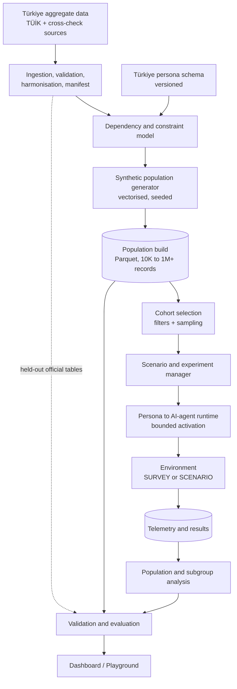
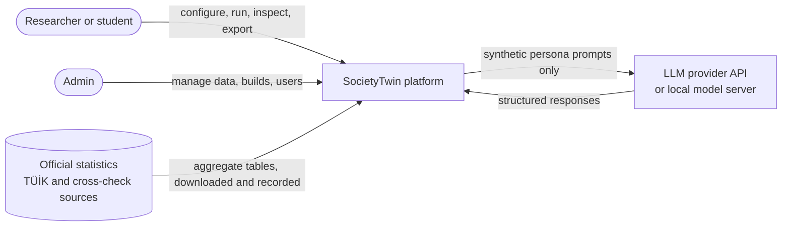
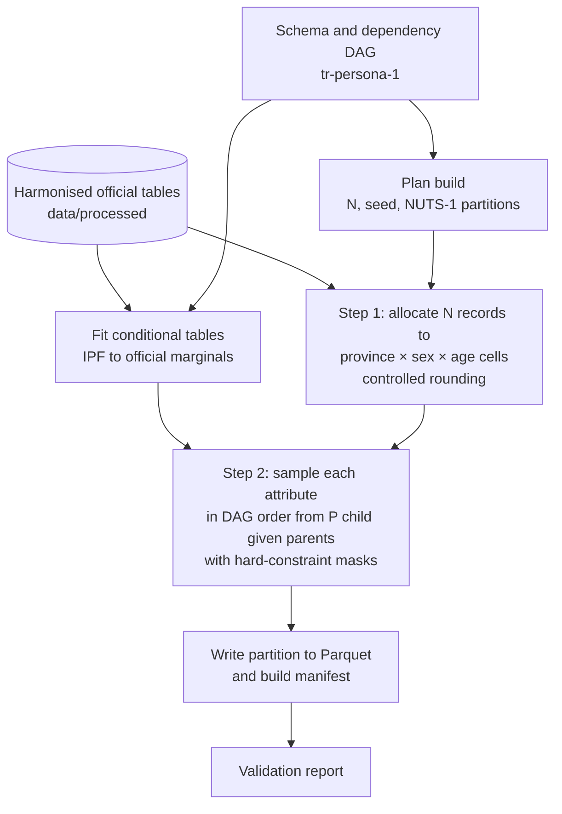
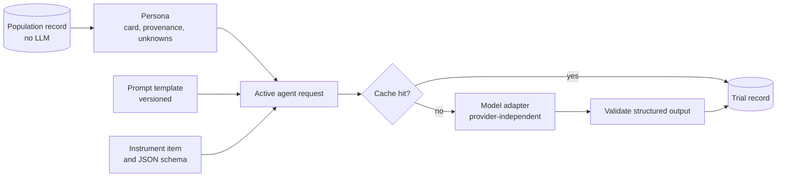
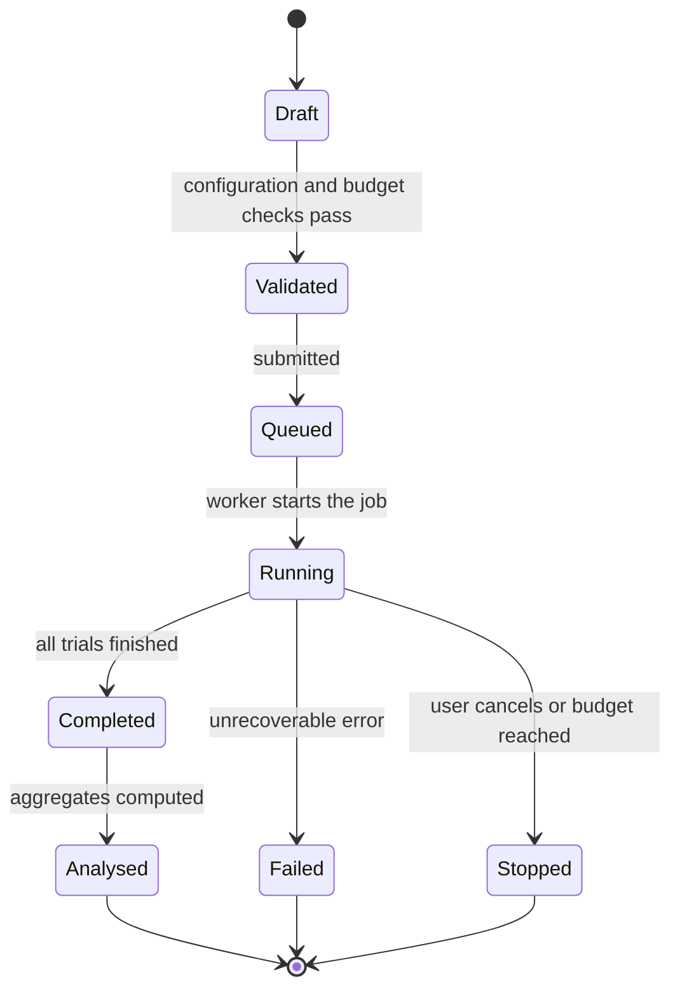

# SocietyTwin v2 Architecture Report

**A Türkiye-only, large-scale, data-grounded synthetic society platform**

| Field | Detail |
|---|---|
| Project | Engineering Design II: SocietyTwin — AI-Powered Digital Society Twin for Türkiye |
| Document status | **PROPOSED** architecture, awaiting instructor and team approval |
| Supersedes | Final Technical Architecture v1.0 (5,000-agent demographic prototype), archived in [archive/architecture-v1-demographic.md](archive/architecture-v1-demographic.md) |
| Implementation status | Not started. This repository contains documentation and placeholder folders only. |

**Labels.** **CONFIRMED**: confirmed instructor requirement or verified fact. **PROPOSED**: design recommendation in this report. **OPEN DECISION**: requires an instructor or team decision. **FUTURE WORK**: outside the semester MVP.

**Decision format.** Each major decision (D-01 to D-17) states *why* it is needed, the *alternatives* considered, *why* the option was chosen, and the *trade-off*.

---

## 1. Executive Summary

SocietyTwin v2 is a research platform that **generates a large synthetic population of Türkiye from official aggregate statistics, validates it statistically, samples cohorts from it, and instantiates a small number of sampled personas as AI agents in reproducible survey and scenario experiments**.

The key design idea is a strict separation of three levels:

1. **Population records**: lightweight, statistically generated rows. The MVP targets builds of up to **1,000,000 records** (PROPOSED), generated without any LLM.
2. **Personas**: richer views of records selected into a cohort, rendered from a versioned template with explicit provenance.
3. **Active AI agents**: personas temporarily instantiated with an LLM for one experiment. Their number is set by the experiment budget (small pilots in the MVP), **not** by the population size.

This separation makes population scale cheap (vectorised generation and columnar storage) while keeping LLM cost proportional only to the size of each experiment cohort.

**What changes from v1.** The 5,000-agent limit, the 60-second 5,000 × 10-year target, the demographic-only agent schema, and the three-model comparison as the main research question are superseded (section 2). Useful v1 work is preserved: historical-validation metrics (MAE, RMSE, subgroup errors, runtime), seeds and reproducibility, the experiment registry, a common result structure, TÜİK as the primary source, and the population-level ethical boundary (section 17).

**What the MVP demonstrates** (section 29): TÜİK data ingestion, an evidence-backed persona schema, dependency-aware generation of up to 1M records, statistical validation, cohort sampling, SURVEY and SCENARIO experiments with a limited number of AI agents, subgroup comparison, reproducibility, and a basic web playground.

---

## 2. Instructor Feedback / Motivation for v2

### Confirmed feedback (CONFIRMED)

- SocietyTwin must focus on **Türkiye only**.
- **5,000 synthetic agents is too small**; the population must be **substantially larger** and the architecture scalable rather than fixed to 5,000.
- SocietyTwin should have **capabilities inspired by modern large-scale synthetic-persona / AI-society systems**. **MatrAIx / Persona-8B** is the main reference.

The exact target size is **not** specified by the instructor (OPEN DECISION, section 35).

### Source priority

When sources conflict, this report follows: (1) new confirmed instructor feedback; (2) the latest project/proposal requirements that do not conflict with it; (3) the latest technical architecture (v1.0); (4) existing GitHub documentation; (5) older planning documents.

### Contradictions with earlier documents

These contradictions are documented rather than silently overwritten.

| Topic | Earlier documents | v2 | Status |
|---|---|---|---|
| Population size | Exactly 5,000 agents (SRS FR-02, TC-01; TÜBİTAK proposal as summarised to the team) | Scalable; benchmarks at 10K / 100K / 1M; 1M default | Direction CONFIRMED; size PROPOSED |
| Performance target | 5,000 agents × 10 years in under 60 s (NFR-02, TC-10) | Separate targets for generation, storage, simulation, and AI activation, set after benchmarks | PROPOSED; targets OPEN DECISION |
| Main research question | ABM vs Cohort-Component / Matrix Projection vs ML comparison | Generation, validation, sampling, and instantiation of a Türkiye persona population (section 5) | PROPOSED; proposal alignment OPEN DECISION |
| Role of LLMs | Excluded from the core simulation | Bounded active agents for sampled cohorts; never used to generate population statistics | Direction CONFIRMED (MatrAIx-inspired); scope PROPOSED |
| Agent schema | Seven demographic fields | About twelve evidence-backed attributes with provenance | PROPOSED |
| Main engine | Mesa-based ABM | Vectorised generator; Mesa optional for small interaction experiments | PROPOSED |
| Data | TÜİK demographic tables | TÜİK population, education, labour, household, and ICT statistics | PROPOSED |

The TÜBİTAK 2209-B proposal text is not stored in this repository. Whether it can be amended to the new research question is an **OPEN DECISION**.

---

## 3. Problem Definition

Researchers and students who want to explore how different groups in Türkiye might respond to a question or a hypothetical situation face three problems:

1. **Real studies are slow and costly**, and real individuals' data is protected.
2. **Existing synthetic-persona systems are global or product-oriented.** MatrAIx, for example, is an infrastructure for evaluating AI systems and digital products with simulated users; its persona base is calibrated to broad global statistics rather than to Turkish official statistics.
3. **LLM-based simulated respondents are known to be unreliable** without careful grounding and validation. They can misportray and flatten identity groups ([Wang et al., 2025](sources.md#core-methodology-sources)), homogenise behaviour ([Wu et al., 2026](sources.md#core-methodology-sources)), and produce results that change under small prompt perturbations ([Ye et al., 2026](sources.md#core-methodology-sources)).

SocietyTwin v2 addresses a narrower, testable problem: **build a synthetic Türkiye population whose statistical properties are traceable to official sources and measurably validated, and provide a reproducible way to sample from it and run bounded AI-persona experiments whose limitations are made explicit.**

### Definitions

| Term | Definition |
|---|---|
| **Population record** | A lightweight, statistically generated record representing a fictional member of Türkiye's synthetic population. Contains only attributes with a defensible source, relationship, or documented assumption. |
| **Persona** | A richer representation derived from one population record: descriptors, provenance, and a persona card. |
| **Active AI agent** | A persona temporarily instantiated with an LLM (or another reasoning model) to take part in one experiment trial. |
| **Population build** | One generated population, identified by schema version, data-manifest version, generator version, seed, and size. |
| **Cohort** | A filtered and sampled set of records from one build, used by an experiment. |
| **Trial** | One active agent completing one item or task in one environment. |

---

## 4. Scope

**In scope (PROPOSED for the semester):** Türkiye aggregate data ingestion; versioned persona schema; dependency-aware population generation at scale; statistical validation; cohort sampling; SURVEY and SCENARIO experiments with bounded AI activation; telemetry; subgroup analysis; reproducibility; a basic web playground.

**Out of scope:** any country other than Türkiye (CONFIRMED); predicting the behaviour of real individuals; identifying or reconstructing real people; special-category attributes (section 25); running an LLM for every stored record; claims that personas represent real Turkish citizens; web/app agent environments in the MVP; production cloud deployment.

---

## 5. Research Questions

All research questions are **PROPOSED** until approved by the instructor.

**Primary research question.** To what extent can a synthetic population of Türkiye generated only from official aggregate statistics reproduce the source distributions and their published cross-tabulations as its size grows, and under what conditions do AI agents instantiated from its personas respond consistently with their persona attributes and comparably to held-out Turkish survey aggregates?

**Secondary research questions.**

1. **Generation.** How much does dependency-aware generation (conditional sampling with IPF calibration) reduce error on held-out cross-tabulations compared with independent-attribute sampling, and how does fidelity change from 10K to 100K to 1M records, particularly for small provinces?
2. **Scale.** What are the runtime, memory, and storage costs of generating, storing, and querying 10K, 100K, and 1M records on a single machine, and where are the bottlenecks?
3. **Persona consistency.** How consistently do LLM agents express their assigned attributes across repeated runs, prompt perturbations, and (budget permitting) different models?
4. **Experiment validity.** For survey items with published TÜİK aggregates that were not used in generation, how close are subgroup response distributions of persona agents to the real aggregates, compared with national-average and demographic-only baselines?

### D-17: Changing the research question

- **Why.** The v1 question (ABM vs Cohort-Component / Matrix Projection vs ML) was built around a 5,000-agent demographic prototype, which the instructor has superseded.
- **Alternatives.** Keep the v1 question and add personas on top; adopt a product-evaluation question like MatrAIx's; adopt a question about generating, validating, and instantiating a Türkiye persona population.
- **Chosen:** the last option, because it matches the confirmed feedback and can be answered with measurable validation within one semester.
- **Trade-off.** The questions in the TÜBİTAK proposal may need to be revised; this is an **OPEN DECISION**. The v1 engines remain available as supporting components (section 17).

**Evaluation hypotheses** (expectations to test, not claims):

- **H1.** Dependency-aware generation has lower held-out conditional error than the independent-attribute ablation.
- **H2.** Province-level marginal error decreases as the build size grows, and the smallest provinces need builds on the order of 1M records for stable estimates.
- **H3.** Persona adherence is higher for directly stated attributes than for behaviours that must be inferred from them.
- **H4.** Persona-agent responses show lower within-subgroup variance than real survey data, as reported in the literature for LLM simulations.

---

## 6. Design Principles

1. **Evidence before breadth.** Only attributes with an official source or documented assumption are included.
2. **Separate population scale from AI scale.** Records are cheap; AI agents are expensive and bounded.
3. **Validation is part of the product.** Every build and experiment produces a validation report.
4. **Reproducible by construction.** Every artefact is traceable to data, configuration, code version, model, and seed.
5. **Population-level only.** No individual-level prediction; no real-person representation.
6. **Simplest architecture that meets the requirements.** Single machine, in-process analytics, one worker. Add distribution only when measurements require it.
7. **Provider independence.** No dependency on a single LLM provider.
8. **Explicit uncertainty.** Results carry intervals, variance, and limitations.

### 6.1 Technology stack (PROPOSED)

| Layer | Choice | Why it is needed | Alternatives considered | Trade-off |
|---|---|---|---|---|
| Language | Python 3.12 (3.11 minimum) | One language for data, generation, analysis, API, and LLM calls; MatrAIx also targets Python 3.12 | Python 3.11 (v1 target) | Team machines must be upgraded (at least one currently has Python 3.9) |
| Arrays | NumPy | Vectorised categorical sampling for millions of rows | Pure Python loops | None significant |
| Tables (small) | pandas | Reading and harmonising TÜİK tables and IPF on small tables; familiar to the team | Polars | Slower on very large tables, but only used on small ones |
| Columnar format | PyArrow + Parquet | Compressed, typed, partitioned storage readable by DuckDB and pandas | CSV (large, untyped), database tables | Binary files need tools to inspect |
| Analytics | DuckDB (embedded) | Fast SQL filtering, sampling, and aggregation directly on Parquet, with no server | PostgreSQL for analytics; Spark | Single-process engine; enough for the MVP scale |
| Metadata and jobs | PostgreSQL (SQLite for local development and tests) | Concurrent writes from API and worker; transactions; a simple durable job queue | SQLite only; Redis + Celery/RQ | One more container to run |
| Statistics | SciPy (selectively) | Distance metrics (for example Jensen–Shannon) and utilities | Hand-written metrics | – |
| Validation of data and configs | Pydantic | Schema, configuration, API models, structured-output validation | Hand-written checks | – |
| API | FastAPI | Typed endpoints, OpenAPI documentation, native Pydantic support | Flask | – |
| LLM access | Thin in-house adapter over provider SDKs or HTTP | Provider independence, testability, full control of logging and caching | LangChain, LiteLLM | Adapters must be written and maintained for each provider |
| Frontend | Next.js + TypeScript | Component-based UI with a typed API client (continuity with v1) | React with Vite | Heavier framework than strictly necessary |
| Charts | Recharts | Bar and distribution charts for subgroup comparison | Plotly | Maps need an additional library (STRETCH) |
| Testing | pytest, Hypothesis, Vitest | Unit, property-based, and frontend tests | – | – |
| Packaging | `pyproject.toml` with a lockfile (uv suggested) | Reproducible environments; MatrAIx uses uv | pip + requirements.txt | New tool for the team |
| Infrastructure | Docker Compose, GitHub Actions | One command to run the stack; CI on every pull request | Cloud deployment | Local or lab machine only; no cloud provider is chosen |
| Agent-based modelling | Mesa: **not in the MVP** | Only needed for small, rule-based interaction experiments | mesa-frames for larger ABMs | See D-08 |

---

## 7. Reference Systems

| System | What it is | SocietyTwin adopts | SocietyTwin does not adopt |
|---|---|---|---|
| **MatrAIx / Persona-8B** ([Li et al., 2026](sources.md#reference-systems); [repository](https://github.com/MatrAIx-ai/MatrAIx-Persona-8B)) | Population-scale simulated-user evaluation infrastructure: 8.3 billion persona records over 1,290 categorical dimensions, a released ~1M coreset, Survey / AI Chatbot / Web / App environments, 18,189 evaluation trials | Dependency-graph (DAG) sampling with compatibility masks; separation of persona records from LLM-powered agents; cohort selection from a larger pool; per-trial telemetry (persona, task, agent, model, seed); run manifest with requested and realised cohort; controlled persona-adherence tests; cross-model checks; Survey-type environment | The 1,290-dimension schema; billions of records; persona extraction from Wikipedia, reviews, and other human-authored sources; Web and App environments in the MVP |
| **MatrAIx grounding position paper** ([MatrAIx Research Community, 2026](sources.md#reference-systems)) | Argues that synthetic personas need explicit grounding and standardised reporting; proposes a six-item checklist | The six-item reporting checklist in every validation report | – |
| **MIT Social Simulation Arena** ([Social Atoms at MIT](sources.md#reference-systems)) | Live benchmark where entrants forecast how a population will answer polls or behave before the real data is released; forecasts are locked and hashed and scored with CRPS, energy score, and rank-biased overlap | Idea of **pre-registered, locked predictions** scored against later real releases (FUTURE WORK) and proper scoring rules for distributions | Competition infrastructure |
| **SimBench** ([Hu et al., 2026](sources.md#core-methodology-sources)) | Benchmark of group-level human-behaviour simulation across 20 datasets; best models reach a modest score (40.80/100) | Group-level distribution comparison as the experiment-validity method; realistic expectations | – |
| **Generative agents** ([Park et al., 2023](sources.md#reference-systems); [Park et al., 2024](sources.md#core-methodology-sources)) | LLM agents with memory, planning, and reflection; later, agents grounded in interviews of 1,052 people outperform demographic-only baselines | Demographic-only baselines as comparison points; honesty about what demographic-only grounding can achieve | Interview-grounded agents (no real-person data is used) |
| **AgentSociety** ([Piao et al., 2025](sources.md#reference-systems)) | Large-scale LLM-driven social simulator with over 10,000 agents | Evidence of what large LLM societies cost and require | Large interacting LLM societies in the MVP |
| **AgentTorch / LLM archetypes** ([Chopra et al., 2024](sources.md#reference-systems)) | Simulates millions of agents by grouping them into LLM "archetypes" | Archetype approach as FUTURE WORK for population-wide AI behaviour | – |
| **SynthPop++** ([Neekhra et al., 2023](sources.md#reference-systems)) | Hybrid country-scale synthetic population combining multiple surveys (India) | Evidence that country-scale synthesis from multiple surveys is feasible; multi-survey harmonisation | Geolocation and family-level detail in the MVP |

---

## 8. Türkiye Data Strategy

Details: [data-strategy.md](data-strategy.md).

- **Primary source (project requirement carried over from the TÜBİTAK proposal; Türkiye-only focus CONFIRMED):** TÜİK official statistics. Türkiye's 2025 resident population from ADNKS is **86,092,168** (verified).
- **MVP tables (PROPOSED):** ADNKS population by province, sex, and age; marital status and household type from administrative registers (NUTS-3); educational attainment from the National Education Statistics Database (NUTS-3, district); labour status, occupation, and sector from the Household Labour Force Survey (annual NUTS-1/2); internet use from the ICT Usage Survey (NUTS-1). Geographic levels are taken from TÜİK's Official Statistics Programme 2022–2026.
- **Cross-check sources:** World Bank (CC BY 4.0) and UN World Population Prospects 2024 (CC BY 3.0 IGO).
- **Microdata:** not required for the MVP. TÜİK Group B microdata is available to eligible researchers on application; eligibility and timing are an **OPEN DECISION**.
- **Reuse terms** for TÜİK portal tables: **OPEN DECISION**.

---

## 9. Persona Schema

Details: [persona-schema.md](persona-schema.md).

### D-03: Schema size and content

- **Why.** The schema determines what the population can say and what can be validated.
- **Alternatives.** (a) Copy a large schema such as MatrAIx's 1,290 dimensions; (b) the v1 seven-field demographic schema; (c) a small evidence-backed Türkiye schema.
- **Chosen: (c)**, about a dozen record attributes (province, sex, age, degree of urbanisation, marital status, education, labour status, occupation group, economic sector, household size and type, internet use, born in another province), each with a source, geography, year, dependencies, limitations, and access status. Income quintile is STRETCH.
- **Trade-off.** Personas are much less rich than MatrAIx personas, but every attribute can be traced and validated. The schema is versioned and extensible.

Special-category attributes (ethnic origin, religion, political opinion, health, and others under KVKK Article 6) and mother tongue are excluded. Personas have codes, not names (D-16).

---

## 10. Dependency Model

### D-04 (part 1): Dependency representation

- **Why.** Independent sampling produces incoherent people (for example occupation unrelated to education) and fails conditional validation.
- **Alternatives.** Independent sampling; a fully learned joint model (needs microdata); a hand-specified DAG with official conditional tables.
- **Chosen:** a **hand-specified DAG** over schema attributes ([persona-schema.md §5](persona-schema.md#5-dependency-model)). Each child is sampled from P(child | parents), estimated from official cross-tabulations. **Hard constraints** (definitional impossibilities) are applied as masks, similar to MatrAIx's compatibility masks. **Soft constraints** are monitored but not masked, so that legitimate rare combinations survive.
- **Trade-off.** The DAG encodes the team's modelling choices, and higher-order dependencies not in official tables are assumed to be conditionally independent given the parents. This is documented and tested with held-out tables and an independent-sampling ablation.

---

## 11. Synthetic Population Generation

**Algorithm (MVP, PROPOSED).**

1. **Fit conditionals.** For each attribute, collect every official table that contains it. Starting from the most detailed available table (for example a national cross-tabulation), use iterative proportional fitting ([Deming & Stephan, 1940](sources.md#core-methodology-sources)) to match all available official marginals, including finer geographies. Extract P(child | parents) and record the fitting residuals.
2. **Allocate.** Allocate exactly N records to province × sex × age-group cells in proportion to ADNKS counts, using controlled rounding that preserves totals (largest-remainder rounding, as in v1, or truncate-replicate-sample integerisation, compared by [Yameogo et al., 2021](sources.md#core-methodology-sources)). Sample single-year ages within age groups.
3. **Sample attributes.** In DAG order, draw each attribute for all records of a partition at once with vectorised inverse-CDF sampling on the fitted conditional table. Apply hard-constraint masks by renormalising over allowed categories.
4. **Write.** Write each partition to Parquet with compact categorical types, and write the build manifest.
5. **Validate.** Produce the validation report ([validation-strategy.md](validation-strategy.md)).

### D-04 (part 2): Generation method

- **Why.** The method determines fidelity, data requirements, and feasibility this semester.
- **Alternatives** (reviewed by [Chapuis et al., 2022](sources.md#core-methodology-sources)):
  - Synthetic reconstruction with IPF from aggregate tables ([Beckman et al., 1996](sources.md#core-methodology-sources)).
  - Iterative proportional updating (IPU) for joint household and person constraints ([Ye et al., 2009](sources.md#core-methodology-sources)).
  - Combinatorial optimisation or reweighting of a microdata sample.
  - Bayesian networks learned from microdata ([Sun & Erath, 2015](sources.md#core-methodology-sources)).
  - MCMC simulation-based synthesis ([Farooq et al., 2013](sources.md#core-methodology-sources)).
  - Deep generative models ([Borysov et al., 2019](sources.md#core-methodology-sources); [Garrido et al., 2020](sources.md#core-methodology-sources) for rare combinations).
- **Chosen for the MVP:** **DAG-ordered conditional sampling with IPF-fitted conditionals**, because it needs only published aggregate tables, is transparent, and is fast to vectorise. **Advanced approach (STRETCH / FUTURE WORK):** a Bayesian network learned from TÜİK Group B microdata (HLFS or SILC) and calibrated to ADNKS marginals with IPF or IPU, if microdata access is granted.
- **Trade-off.** Without microdata, dependencies beyond published cross-tabulations are assumed, not learned. Methods that need microdata or heavy training were not chosen, because microdata access is uncertain and they are harder to explain and validate in one semester.

### D-05: Households

- **Why.** Linked households require joint household–person constraints and household composition tables.
- **Alternatives.** (a) Build linked households with hierarchical IPF or IPU; (b) represent household size and type as attributes of each person; (c) omit households.
- **Chosen: (b) in the MVP**, with (a) as STRETCH.
- **Trade-off.** Household-level analyses (for example household income) are not possible in the MVP, but person-level household context is available and the schema stays simple.

---

## 12. Scalability Strategy

SocietyTwin separates four kinds of scale.

| Dimension | MVP (PROPOSED) | Stretch | Not promised |
|---|---|---|---|
| **Population generation** (records per build) | Benchmarks at 10K, 100K, and 1M; 1M default | Full scale (about 86.1 million records) with partitioned generation | – |
| **Storage** | Parquet partitioned by NUTS-1; order of tens of MB per 1M records (estimate) | Several GB at full scale (estimate) | – |
| **Simulation** (rule-based dynamics over all records) | None in the MVP | Vectorised yearly dynamics (aging, births, deaths, migration) | LLM-driven dynamics for every record |
| **AI-agent activation** (per experiment) | Small pilots, for example 50–200 agents (example, budget-bound) | Up to about 1,000 agents if budget allows (example) | Millions of simultaneous LLM agents |

### D-02: Default population size

- **Why.** The instructor requires a substantially larger, scalable population, but no size is specified.
- **Alternatives.** 100K (easy, but small provinces get only about a hundred records each); 1M; full scale (about 86.1M; large storage and memory).
- **Chosen: 1M default, with 10K and 100K for development and testing, and full scale as STRETCH.** With about one record per 86 residents, the smallest provinces (well under 100,000 residents, *verify*) still get on the order of a thousand records, enough for province-level validation.
- **Trade-off.** 1M is 200 times larger than v1, but still a sample: each record carries a weight of about 86 residents. Full-scale generation is feasible with partitioning but is not needed to answer the MVP research questions.

**Memory and storage estimates** (back-of-envelope, to be measured): twelve categorical attributes stored as 8- or 16-bit codes plus a 64-bit ID need roughly 20–40 bytes per record in memory, which is about 20–40 MB for 1M records and about 2–3.5 GB for full scale. Full-scale builds must therefore be generated partition by partition.

### D-07: Compute model

- **Why.** Generation and analysis must scale without complex infrastructure.
- **Alternatives.** Distributed processing (Spark, Dask, Ray); multiprocessing over partitions; single-process vectorised code.
- **Chosen:** single-process vectorised NumPy per partition, with optional multiprocessing over NUTS-1 partitions. **No distributed framework** in the MVP.
- **Trade-off.** Limited to one machine. Distribution is added only if benchmarks show that a full-scale build cannot finish on one machine.

### D-08: Mesa

- **Why.** v1 used Mesa as the main engine.
- **Alternatives.** Keep Mesa as the core; mesa-frames (Polars-backed Mesa extension reporting up to 10× speed-ups for large agent sets); vectorised arrays.
- **Chosen:** Mesa is **not part of the MVP core**. Population storage and generation use columnar data, not per-agent Python objects. Mesa (or mesa-frames) may be used for small, rule-based interaction experiments (STRETCH / FUTURE WORK).
- **Trade-off.** Mesa's modelling conveniences (schedulers, spaces, data collectors) are not used in the core. They are not needed for generating and querying records.

---

## 13. Persona Sampling

- **Filters.** Structured filter specifications on record attributes (never raw SQL from the user), executed with DuckDB on Parquet.
- **Sampling.** Simple random sampling without replacement, and stratified sampling with proportional or equal allocation, each with a recorded seed.
- **Weights.** Each sampled record carries an inclusion weight. Subgroup estimates are weighted back to the population.
- **Two-stage sizes.** The cohort (personas materialised, for example up to 10,000) can be larger than the set of records activated as AI agents in a given experiment, which is limited by the budget.
- **Manifest.** Requested cohort (filters, size, method, seed) and realised cohort (record IDs) are both stored, following MatrAIx.

**Why this design.** It makes cohorts reproducible and statistically interpretable. **Alternative:** hand-picking personas, which is not reproducible and biases results. **Trade-off:** stratified designs with equal allocation need weighting, which adds complexity to analysis.

---

## 14. AI-Agent Architecture

### D-01: Three-level separation (record, persona, active agent)

- **Why.** Running an LLM for every stored person is neither affordable nor necessary; population size and AI activation are different concerns.
- **Alternatives.** An LLM agent per record (as in some large LLM societies, at high cost); archetype-based LLM calls shared by many records ([Chopra et al., 2024](sources.md#reference-systems)); activation only for sampled cohorts.
- **Chosen:** activation **only for sampled cohorts**, per trial, with no persistent agent memory in the MVP. Archetypes are FUTURE WORK.
- **Trade-off.** No population-wide AI behaviour and no long-running agent societies in the MVP, but cost scales with the experiment, and every trial is independent and reproducible.

### D-09: Model runtime

- **Chosen (PROPOSED):**
  - a provider-independent adapter;
  - structured JSON outputs validated with Pydantic;
  - asynchronous execution with a concurrency limit, retries, and backoff;
  - a response cache keyed by model, prompt version, persona hash, item, and parameters;
  - a budget guard;
  - a deterministic stub model for tests.
- **Alternatives.** A single provider SDK throughout the code; an agent framework such as LangChain.
- **Trade-off.** More code to maintain, but no provider lock-in, and every call is logged in a consistent format.

Which provider and model to use, whether local models are acceptable, and the budget are **OPEN DECISIONS** (section 35).

---

## 15. Experiment Playground

Details: [experiment-system.md](experiment-system.md).

### D-10: Environments in the MVP

- **Why.** Each environment adds implementation and validation cost.
- **Alternatives.** All five candidate environments (SURVEY, CHAT, SCENARIO, ABM/social interaction, WEB/APP); SURVEY only; SURVEY and SCENARIO.
- **Chosen: SURVEY and SCENARIO in the MVP.** Both are single-trial and parallel, map to published survey aggregates, and support persona-consistency tests. CHAT is STRETCH; rule-based ABM dynamics are STRETCH; LLM social interaction and WEB/APP environments are FUTURE WORK.
- **Trade-off.** The MVP does not show multi-turn or interactive behaviour, which is a visible part of MatrAIx. **OPEN DECISION:** whether the instructor considers SURVEY + SCENARIO sufficient.

---

## 16. Scenario System

A **scenario** in v2 is a versioned experiment configuration that changes the *situation presented to personas* while keeping the cohort, instrument version, model, and seeds fixed. This preserves the v1 idea of controlled comparisons against a baseline.

- **Baseline condition:** the instrument without the scenario manipulation.
- **Treatment conditions:** the same items with a controlled change (for example a described change in a public service), randomly assigned to cohort members with a recorded seed.
- **Comparison:** response distributions between conditions, by subgroup, with intervals.
- **Population-dynamics scenarios (STRETCH):** the v1 demographic scenario parameters (birth-rate and death-rate multipliers, net migration) remain valid for the optional rule-based dynamics engine (section 17).

**Limit.** Scenario results describe how persona agents respond to a described situation. They are not predictions of how real people would respond, and counterfactual scenarios cannot be validated against reality.

---

## 17. ABM / Cohort / ML Integration Decision

### D-11: Role of the v1 model engines

| v1 component | v2 role | Reason |
|---|---|---|
| Agent-based demographic model (aging, births, deaths, migration) | **C. Optional experiment engine (STRETCH)**, re-implemented as vectorised dynamics over population records | Useful to produce time-shifted populations and population-dynamics scenarios, but not needed for the MVP research questions |
| Cohort-Component / Matrix Projection | **B. Supporting validation engine (STRETCH)** | A deterministic benchmark to check the dynamics engine (docking) and the population's age structure over time |
| ML forecasting baseline | **D. Future extension**; the *concept* of a statistical baseline is reused as the **demographic-only baseline** for survey experiments (section 18) | v2 is not a forecasting project; a baseline is still essential to judge whether persona agents add anything |
| Historical validation, MAE, RMSE, age-group errors, runtime | **Preserved** and generalised to subgroup errors for all validation levels | Directly reusable |
| Seeds, reproducibility, experiment registry | **Preserved** and extended to builds, cohorts, and LLM calls | Directly reusable |
| Common ResultFrame | **Preserved as a concept**, generalised to the long-format Common Result Schema (section 19) | Same goal: all methods report in one comparable structure |

- **Alternatives.** Keep the three-model comparison as the core (conflicts with the confirmed feedback); delete the v1 engines (loses useful validation work).
- **Trade-off.** Population dynamics are not demonstrated in the MVP unless time allows.

---

## 18. Validation Framework

Details: [validation-strategy.md](validation-strategy.md).

### D-12: Five validation levels

| Level | Main metrics |
|---|---|
| Statistical representativeness | TVD, JSD, MAE of shares, SRMSE, subgroup errors, across seeds and sizes |
| Conditional consistency | Conditional TVD on held-out cross-tabulations, Cramér's V difference, hard-constraint violation rate (must be 0), rare-cell recall, independent-sampling ablation |
| Persona consistency | Attribute self-report accuracy, controlled adherence rate, stability, robustness audit, stereotype audit |
| Experiment validity | TVD and JSD versus held-out Turkish survey aggregates, compared with national-average and demographic-only baselines; within-subgroup variance |
| Reproducibility | Build checksums, identical cohorts, cache replay |

- **Why.** Each level supports a different, limited claim, so SocietyTwin never claims that personas represent real people.
- **Alternatives.** A single "realism" score; LLM-as-judge realism ratings (rejected: unverifiable and circular).
- **Trade-off.** Experiment validity can only be measured where real Turkish aggregates exist.
- **Thresholds** are an **OPEN DECISION** to be set after baseline measurements.

---

## 19. Result/Telemetry Model

- **Trial records:** one row per persona × item × repetition, with identity, configuration (environment, instrument version, prompt version, model, parameters, seed), output (structured answer, rationale, validity), usage (latency, tokens, estimated cost, cache hit), and timestamps. This follows MatrAIx's per-trial record of persona, task, agent, model, and seed.
- **Common Result Schema:** long-format aggregates (`experiment_id`, `item_id`, subgroup keys, category, weighted share, count, interval). All environments and any future engines report into this schema, continuing the purpose of v1's Common ResultFrame.
- **Storage:** trial records as Parquet (and JSON Lines for raw responses) in `data/results/`, indexed in PostgreSQL. All of it is git-ignored.

---

## 20. Reproducibility

### D-13: Manifests and seeds

| Manifest | Contents |
|---|---|
| Build manifest | Data-manifest version and checksums, schema version, generator version, Git commit, N, seed, partitioning, validation summary, build checksum |
| Cohort manifest | Build ID, filter specification, sampling method, sample size, seed, realised record IDs |
| Experiment manifest | Cohort ID, environment, instrument ID and version, prompt template version, model provider, name, and version, adapter version, parameters, seeds, budget, Git commit |

- **Random numbers.** A build seed is split into independent streams per partition with NumPy's `SeedSequence`, so results do not depend on the order in which partitions are processed.
- **LLM non-determinism.** Replaying from the response cache reproduces results exactly. Fresh runs are expected to vary, and the variation is measured and reported.
- **Trade-off.** The cache stores model outputs, which must be kept out of Git and managed for size.

---

## 21. API Architecture

FastAPI, with read-mostly endpoints and long operations run as jobs (PROPOSED):

| Method | Endpoint | Purpose |
|---|---|---|
| GET | `/schemas`, `/schemas/{version}` | Persona schema versions |
| GET | `/datasets` | Data manifest entries |
| POST | `/builds` | Request a population build `{schema_version, n, seed}`; returns a job |
| GET | `/builds/{id}`, `/builds/{id}/validation` | Build status and validation report |
| GET | `/builds/{id}/summary` | Aggregated distributions (`group_by` parameters) |
| POST | `/cohorts` | Create a cohort `{build_id, filters, size, sampling, seed}` |
| GET | `/cohorts/{id}` | Realised cohort counts |
| GET | `/personas/{build_id}/{record_id}` | Persona card (labelled synthetic) |
| POST | `/experiments` | Create and queue an experiment `{cohort_id, environment, instrument, model, seeds, budget}` |
| GET | `/experiments/{id}` | Status, progress, usage |
| POST | `/experiments/{id}/cancel`, `/experiments/{id}/reproduce` | Control |
| GET | `/experiments/{id}/trials`, `/experiments/{id}/results` | Trial browser and aggregated results |
| GET | `/experiments/{id}/export` | CSV or Parquet export |

### D-14: Job execution

- **Why.** Builds and experiments take minutes to hours and must survive API restarts.
- **Alternatives.** FastAPI background tasks (not durable); Redis with Celery or RQ (extra infrastructure); a PostgreSQL job table polled by a worker.
- **Chosen:** a **PostgreSQL-backed job table** with one asynchronous worker process (jobs claimed with row locking).
- **Trade-off.** Fewer features than a dedicated queue, but no extra services. A dedicated queue can be added if needed.

### Runtime and deployment

LLM credentials exist only in the worker's environment and never reach the browser or the API responses.

---

## 22. Frontend Architecture

### D-15: Frontend

- **Chosen:** Next.js with TypeScript, a typed API client generated from the OpenAPI schema, and Recharts for distribution and subgroup charts. Province maps are STRETCH (the map library and boundary-data licence are **OPEN DECISIONS**).
- **Pages:** Populations, Cohort builder, Experiment designer, Run monitor, Results, Registry ([experiment-system.md §7](experiment-system.md#7-playground-pages-proposed)).
- **Rule:** the frontend never computes statistics. It displays aggregates computed by the backend, and every page with persona output carries the synthetic-data label.
- **Alternatives.** React with Vite (lighter); a Python dashboard framework such as Streamlit (faster to build, less suitable for a multi-page playground).
- **Trade-off.** Next.js is heavier than needed, but keeps continuity with v1 and supports a multi-page application.

---

## 23. Storage Architecture

### D-06: Storage

| Data | Store | Why |
|---|---|---|
| Raw and processed official tables | Files in `data/raw/`, `data/processed/` (Parquet) | Keeps originals unchanged; processed tables are reproducible |
| Population builds | Parquet in `data/populations/{build_id}/nuts1=TRx/` | Columnar, compressed, partitioned; queried with DuckDB |
| Trial records and raw responses | Parquet / JSON Lines in `data/results/{experiment_id}/` | Append-friendly, analysable with DuckDB |
| Registry, manifests, jobs, trial index | PostgreSQL (SQLite in development and tests) | Transactions, concurrent API and worker access |
| LLM response cache | Local cache directory (git-ignored) or a PostgreSQL table | Replay and cost control |

- **Alternatives.** Store everything in PostgreSQL (simpler operations, slow analytics on millions of rows); everything in files (no concurrent job state).
- **Trade-off.** Two storage systems, each used for what it does well.
- **Git:** none of these data stores are committed ([.gitignore](../.gitignore)); only small artificial test fixtures under `tests/fixtures/` may be tracked.

---

## 24. Security

- Secrets only in server-side environment variables (`.env` git-ignored); LLM keys only in the worker.
- Input validation with Pydantic for all API requests and configurations; filters are structured, never raw SQL.
- Researcher and Admin roles (carried over from v1); whether authentication is needed in the MVP is an **OPEN DECISION**.
- Rate and budget limits on experiments.
- Instruments are treated as untrusted text, and persona prompts are built from templates. Prompt-injection risk mainly applies to the future CHAT environment, where an external system's replies reach the agent.
- Dependency updates and secret scanning in CI (GitHub Actions).

---

## 25. Privacy

- Only published aggregate statistics are used in the MVP, so no personal data is processed. KVKK Article 28(b) exempts anonymised statistical processing, as noted in TÜİK's Official Statistics Programme.
- Special categories under KVKK Article 6 are excluded from the schema.
- No names, addresses, or real identifiers are generated or stored.

### D-16: No generated personal names

- **Why.** Realistic Turkish names would make personas look like real citizens, and name choice can carry ethnic, religious, or regional stereotypes.
- **Alternatives.** Generated names (as in many persona systems); pseudonymous codes.
- **Chosen:** codes only (for example `TR-06-000123`), shown with the synthetic-data label.
- **Trade-off.** Persona cards read less naturally, but no persona can be mistaken for, or be linked to, a real person.
- Microdata, if ever used, stays inside TÜİK-approved procedures and never enters Git ([data-strategy.md §3](data-strategy.md#3-microdata-not-required-for-the-mvp)).
- LLM providers receive only synthetic persona cards and research instruments.

---

## 26. Ethics

Details: [ethics-and-limitations.md](ethics-and-limitations.md). The main risks are source-data bias, representation limits, statistical uncertainty, hallucination, LLM persona stereotyping and flattening, model opinion bias, fragile results, over-interpretation, and misuse. Mitigations include provenance classes, subgroup and variance reporting, robustness and stereotype audits, mandatory "synthetic, not a prediction" labels, and framing results as hypotheses for real studies.

---

## 27. Performance Strategy

- **Vectorise everything** in generation: no per-record Python loops; compact integer category codes.
- **Partition** builds by NUTS-1 region, and process partitions independently (optionally in parallel).
- **Query in place** with DuckDB on Parquet; never load full builds into the API process.
- **Benchmark** generation, validation, and cohort queries at 10K, 100K, and 1M records, reporting runtime, peak memory, and storage size. Targets are set after the first measurements (**OPEN DECISION**); no performance guarantee is made.
- **LLM cost control:** estimate tokens before a run (agents × items × (prompt + output tokens)), run a small pilot first, use the cache, bound concurrency, and stop at the budget.

---

## 28. Testing Strategy

| Level | What is tested | Tools |
|---|---|---|
| Unit | IPF convergence on small artificial tables; allocation preserves totals; sampling respects masks; metrics match hand-computed values | pytest |
| Property-based | For random small tables: totals preserved, zero hard-constraint violations, same seed gives identical output, output independent of partition processing order | Hypothesis |
| Schema and config | Schema versions, instruments, and experiment configurations validate; invalid configurations are rejected with clear errors | pytest + Pydantic |
| Integration | Tiny artificial data manifest → 10K build → validation → cohort → SURVEY experiment with the stub model → results → export | pytest |
| API contract | Endpoints, status codes, error shapes | pytest + FastAPI test client |
| Frontend | Components and API client | Vitest |
| Performance | 10K / 100K / 1M benchmarks | Manual or scheduled, not in every CI run |

No real LLM calls and no real TÜİK data in CI; tests use small, clearly artificial fixtures.

---

## 29. MVP

PROPOSED minimum viable product for the semester:

1. **Data:** ingest, validate, and harmonise the MVP TÜİK tables, with a data manifest.
2. **Schema:** persona schema `tr-persona-1` with about a dozen attributes and provenance.
3. **Dependency model:** DAG, IPF-fitted conditionals, hard-constraint masks.
4. **Generator:** vectorised, seeded, partitioned; builds at 10K, 100K, and 1M.
5. **Validation:** representativeness and conditional-consistency report with the independent-sampling ablation; performance report.
6. **Cohorts:** filters, simple random and stratified sampling, weights, manifests.
7. **Personas:** template-based persona cards with unknowns statements.
8. **Experiments:** SURVEY and SCENARIO environments; provider-independent adapter with a stub model; caching; budget guard; small AI-agent pilots.
9. **Analysis:** subgroup comparison with weights and intervals; CSV and Parquet export.
10. **Experiment-validity pilot:** one comparison with held-out Turkish survey aggregates, if a suitable table is confirmed.
11. **Reproducibility:** build, cohort, and experiment manifests; cache replay.
12. **Playground:** basic web UI for builds, cohorts, experiments, monitoring, and results.

---

## 30. Stretch Goals

- CHAT environment.
- Linked households with hierarchical IPF or IPU.
- Income quintile attribute (if suitable cross-tabulations exist or microdata is granted).
- Bayesian-network generator from TÜİK Group B microdata.
- Full-scale (about 86.1M) partitioned build.
- Vectorised population dynamics (aging, births, deaths, migration) with the Cohort-Component / Matrix Projection benchmark.
- Province choropleth maps.
- Cross-model robustness audits with a second LLM.
- Demographic-only statistical baseline implemented with scikit-learn.

---

## 31. Future Work

- WEB and APP evaluation environments.
- LLM agent interaction and social networks (possibly with Mesa or mesa-frames), and archetype-based population-wide AI behaviour.
- Survey-grounded dispositions (life satisfaction, values) as persona attributes, with licensed sources and validation.
- Pre-registered predictions for upcoming TÜİK releases, scored as in the Social Simulation Arena.
- Deep generative population synthesis for rare combinations.
- Time-shifted populations from TÜİK population projections.
- Turkish-language LLM evaluation for persona simulation.
- Economic and policy scenarios (such as the minimum-wage example from the original course brief).

---

## 32. Risks and Mitigations

| Risk | Impact | Mitigation |
|---|---|---|
| Needed TÜİK cross-tabulations are not published | Weaker dependency model | Feasibility check first; drop or defer attributes; document assumptions |
| TÜİK reuse terms unclear | Legal and publication risk | Confirm terms before release; keep data out of Git |
| Microdata not accessible | No learned joint model | MVP does not depend on microdata |
| LLM budget unknown or small | Few agents per experiment | Stub model; small pilots; cache; budget guard |
| LLM results fragile or stereotyped | Invalid conclusions | Robustness and stereotype audits; variance reporting; conservative claims |
| Scope creep toward a MatrAIx clone | Missed MVP | MVP limited to SURVEY and SCENARIO; everything else STRETCH or FUTURE WORK |
| Team unfamiliar with Parquet, DuckDB, or async code | Slower progress | Keep the stack small; examples in documentation; pair on core modules |
| 1M build slower than expected | Validation delays | Develop at 10K and 100K; benchmark early; partition |
| Instructor expects a different scale or environment | Rework | Resolve the open decisions (section 35) before implementation |

---

## 33. Semester Implementation Roadmap

The week ranges assume the 14-week plan used by SRS v1.0. The remaining semester calendar is an **OPEN DECISION** and must be confirmed.

| Phase | Weeks | Deliverables |
|---|---|---|
| 0. Approval and feasibility | 1–2 | Instructor decisions (section 35); confirmed TÜİK tables and terms; schema `tr-persona-1` signed off |
| 1. Data and generator core | 3–5 | Ingestion and manifest; harmonisation; IPF-fitted conditionals; 10K and 100K builds; first validation report |
| 2. Scale and cohorts | 6–7 | 1M builds; performance benchmarks; cohort sampling; persona cards |
| 3. Experiments | 8–10 | SURVEY and SCENARIO environments; model adapter and stub; cache; budget guard; registry; first small AI pilot |
| 4. Playground and analysis | 11–12 | Web UI; subgroup comparison; exports; experiment-validity pilot |
| 5. Evaluation and reporting | 13–14 | Robustness checks; final validation report; documentation; presentation |

Module ownership is **not** assigned in this report (**OPEN DECISION**, see [team-responsibilities.md](team-responsibilities.md)).

---

## 34. Repository Migration Plan

Details: [migration-plan.md](migration-plan.md). This branch performs **documentation migration only**. Implementation migration (moving `src/` placeholders into the target package layout) happens when implementation starts, in a separate change.

---

## 35. Open Instructor Decisions

1. **Population size.** Is a 1M-record default acceptable, or is a full-scale (about 86.1M) population expected?
2. **"MatrAIx-inspired" scope.** Are SURVEY and SCENARIO environments sufficient for the MVP, or is CHAT required?
3. **Research question.** Can the TÜBİTAK 2209-B proposal's research question be revised to the v2 question (section 5)?
4. **LLM provider and budget.** Which providers are allowed, what budget is available, and are local models acceptable or required?
5. **Interaction language.** Turkish, English, or both?
6. **Excluded attributes.** Confirm the exclusion of special-category attributes and mother tongue.
7. **Microdata.** Should the team apply for TÜİK Group B microdata, and is the team eligible?
8. **Validation thresholds.** What level of error counts as acceptable representativeness?
9. **Held-out data.** Which Turkish survey aggregates should be held out for experiment validity?
10. **Population dynamics.** Is the v1 demographic dynamics work (aging, births, deaths, migration) still wanted, and at what priority?
11. **Households.** Are person-level household attributes acceptable, or are linked households required?
12. **Ethics review.** Is an ethics review required for AI-persona experiments?
13. **Hosting.** Is local Docker deployment sufficient?
14. **Timeline.** What are the remaining semester milestones for v2?
15. **Ownership.** How are the new modules assigned within the team?

---

## 36. References

Full annotations are in [sources.md](sources.md). Key references:

- Li, X., Hao, Y., et al. (2026). *MatrAIx: Simulating the World with 8.3 Billion Persona Agents.* arXiv:2608.04205. Code: <https://github.com/MatrAIx-ai/MatrAIx-Persona-8B>
- MatrAIx Research Community (2026). *Position: Synthetic Persona Needs Explicit Grounding and Standardized Reporting.* <https://matraix.ai/research/synthetic-persona-grounding.html>
- Social Atoms at MIT. *Social Simulation Arena.* <https://github.com/Social-Atoms/social-sim-arena>
- Hu, T., et al. (2026). *SimBench: Benchmarking the Ability of Large Language Models to Simulate Human Behaviors.* ICLR 2026. arXiv:2510.17516
- Chapuis, K., Taillandier, P., & Drogoul, A. (2022). Generation of Synthetic Populations in Social Simulations. *JASSS* 25(2) 6. doi:10.18564/jasss.4762
- Deming, W. E., & Stephan, F. F. (1940). *Annals of Mathematical Statistics* 11(4), 427–444. doi:10.1214/aoms/1177731829
- Beckman, R. J., Baggerly, K. A., & McKay, M. D. (1996). *Transportation Research Part A* 30(6), 415–429. doi:10.1016/0965-8564(96)00004-3
- Sun, L., & Erath, A. (2015). *Transportation Research Part C* 61, 49–62. doi:10.1016/j.trc.2015.10.010
- Park, J. S., et al. (2023). Generative Agents. *UIST 2023.* doi:10.1145/3586183.3606763
- Wang, A., Morgenstern, J., & Dickerson, J. P. (2025). *Nature Machine Intelligence* 7, 400–411.
- TÜİK. *Official Statistics Programme 2022–2026* and *Address Based Population Registration System Results 2025*.
